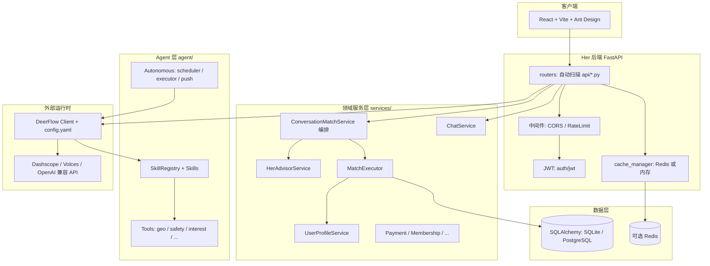

# Her 系统文档（代码扫描版）

> 生成方式：基于当前代码库扫描（重点覆盖 `src/`、`frontend/src/`、`deerflow/` 配置与核心实现），不依赖既有 Markdown 文档。

**相关文档**：

- [主路径收敛完整方案（IMP-001）](docs/GOLDEN_PATH_SOLUTION.md) — 产品叙事、交互分层、工程契约与分期排期，便于执行与验收。  
- [Her 顾问链 → DeerFlow 替代路线图](docs/HER_TO_DEERFLOW_MIGRATION_ROADMAP.md) — 分阶段迁移、工具补齐、编排下沉与 API 废弃顺序。

## 1. 系统愿景（Vision）与核心痛点

## 1.1 愿景推断

从当前代码实现看，Her 正在从“传统婚恋匹配系统”进化为“AI Native 关系经营平台”，核心特征是：

- 以对话为主入口，弱化传统菜单驱动操作；
- 让 AI（Her Advisor + DeerFlow Agent）承担决策与解释，而非仅做文案生成；
- 将“匹配前推荐”延展到“匹配后聊天、关系推进、安全验证、会员变现、长期关系运营”全生命周期。

简化定义：**Her 的目标是做一个可持续学习、可解释、可运营的 AI 红娘与关系协同系统。**

## 1.2 当前在解决的核心痛点

- 传统匹配平台“只推荐不陪跑”，用户在聊前、聊中、聊后缺少持续指导；
- 用户自述偏好与真实适配常常错位，导致“想要的”和“适合的”不一致；
- 聊天与关系推进效率低，缺少可操作建议（话题、节奏、风险提醒）；
- 用户信任难建立（认证、风险控制、行为可信度）；
- AI 功能碎片化常见，难以统一到一个对话体验与数据闭环中。

---

## 2. 总体架构概览

## 2.1 架构分层

系统主要由四层组成：

- **接入层**：FastAPI 路由（`src/api/`）+ 前端 React/Vite（`frontend/src/`）；
- **领域服务层**：匹配、画像、聊天、会员、支付、通知、安全、AI 感知等服务（`src/services/`）；
- **AI/Agent 层**：Her Advisor（推理与建议）+ DeerFlow Agent Runtime（工具编排、记忆、流式响应）；
- **数据与基础设施层**：SQLAlchemy 模型、Repository、JWT、缓存、限流、日志、审计与指标。

## 2.2 后端运行与生命周期

- 入口：`src/main.py`；
- 启动流程包含：数据库初始化、缓存初始化、审计系统初始化、自主代理表初始化、Her Advisor 初始化、Skills 注册、心跳调度器启动；
- 路由采用自动发现与注册（`src/routers/__init__.py`），按 `src/api/*.py` 中 `router*` 自动挂载；
- 暴露基础治理端点：`/health`、`/metrics`、`/`（系统能力摘要）。

## 2.3 前端运行形态

- 技术栈：React 18 + TypeScript + Ant Design + Vite；
- 应用入口 `frontend/src/App.tsx`，登录后直接进入 `HomePage`；
- 交互以聊天与推荐为中心，叠加抽屉/懒加载页面承载高级功能；
- API 统一走 `apiClient`（Axios 拦截器 + JWT 自动刷新 + 开发态 fallback 身份）。

## 2.4 AI 双引擎架构

- **Her Advisor 路径**：`/api/her/chat` 等接口驱动 `ConversationMatchService + HerAdvisorService`，重点解决匹配建议、认知偏差、可解释输出；
- **DeerFlow 路径**：`/api/deerflow/*` 驱动 Agent Runtime（工具调用、记忆注入、流式 SSE/事件、线程上下文）；
- 两条路径在前端并存：同步能力与流式能力按场景调用。

---

## 3. 关键配置与基础能力

## 3.1 配置中心（`src/config.py`）

主要配置域：

- 运行环境：`ENVIRONMENT/DEBUG/HOST/PORT`；
- LLM：供应商、模型、温度、token、超时、重试、降级模式；
- 聊天自动画像更新阈值：冷却时间、确认窗口、字段阈值；
- 外部服务：地图、天气、预订、推送、短信、支付；
- 安全：JWT、CORS、敏感字段；
- 数据：数据库 URL、连接池、Redis；
- 日志治理：保留/备份策略。

配置设计特征：

- 以 `Her/` 项目根为路径锚点；
- 生产环境做强校验（如 DEBUG、CORS、JWT、关键密钥）；
- 非生产环境支持自动生成并持久化 JWT Secret。

## 3.2 数据库与会话（`src/db/database.py`）

- SQLAlchemy 同步引擎；
- SQLite 与 PostgreSQL 双模式；
- 连接池参数可配置；
- `get_db()` 统一依赖注入，包含 trace 级别日志；
- `init_db()` 在启动时建表。

## 3.3 认证与会话安全（`src/auth/jwt.py`）

- 双 Token 机制：`access_token + refresh_token`；
- `token_type` 区分访问与刷新；
- 支持前端 SHA-256 后密码再 bcrypt 校验；
- 提供可选认证策略：开发环境支持 `X-Dev-User-Id` 与匿名 fallback。

## 3.4 平台治理能力

- 限流中间件：保护核心接口；
- 缓存管理：匹配结果、互赞结果、部分服务缓存；
- 健康检查与指标：数据库/缓存/限流/性能统计；
- 审计与日志：异常保护、敏感信息避免直出、链路日志强化。

---

## 4. 数据模型与领域边界

## 4.1 模型组织方式

数据模型从单文件重构为领域拆分（`src/db/models/`），统一由 `__init__.py` 导出。领域包含：

- 用户核心、匹配、对话、聊天、照片；
- 认证验证、会员订阅、视频约会；
- AI 集成、预沟通、安全域；
- 用户画像、灰度实验、关系进展；
- 通知与候选反馈。

## 4.2 业务数据主线

- **用户主档**：基础信息、偏好、关系目标、认证状态；
- **匹配行为**：推荐结果、滑动动作、匹配历史、反馈学习；
- **聊天关系**：会话、消息、已读与摘要；
- **AI 衍生数据**：语义分析、画像更新、认知偏差、LLM 指标；
- **商业化**：会员、订单、功能使用额度。

---

## 5. 已实现功能清单（含交互逻辑）

## 5.1 用户与认证域

- 用户注册/登录/刷新令牌/登出；
- 当前用户信息查询与更新；
- 微信登录链路（前后端均有接口/页面支撑）；
- 密码安全策略（前端哈希 + 后端 bcrypt）。

典型交互：

1. 前端登录页提交用户名与 SHA-256 密码摘要；
2. 后端验证并返回 access/refresh；
3. 前端拦截器在 401 时自动刷新并重放请求；
4. 刷新失败触发全局 `auth:expired` 回到登录态。

## 5.2 匹配与推荐域

- 推荐匹配列表（支持缓存）；
- 双向匹配查询；
- 兼容性计算；
- 滑动操作（like/pass/super_like）与撤销；
- 匹配偏好管理（年龄、地点、关系目标等）。

核心逻辑：

- `matching API` 不再依赖旧内存池，统一由 `ConversationMatchService` 和 AI 评估驱动；
- 结果中包含兼容度、分项分数、共同兴趣、推荐理由；
- 会员服务参与每日额度与权限控制。

## 5.3 聊天与会话域

- 会话列表、历史消息、发送消息、已读管理；
- WebSocket 实时通信（心跳、重连、消息队列）；
- 快聊能力（快速提问、回复建议、话题画像）；
- 模拟回复与聊天分析能力。

关键升级点：

- 聊天过程中支持“无感画像更新”：规则抽取 + 小模型兜底提取；
- 更新行为有证据记录（`UserProfileUpdateDB`）与阈值控制，避免误写入。

## 5.4 Her Advisor（顾问脑）

- 用户意图分析（匹配请求、咨询、反馈、偏好更新等）；
- 查询质量校验（是否信息充分、是否需要追问）；
- 认知偏差分析（想要 vs 适配）；
- 匹配建议生成（推荐等级、风险提示、建议动作）；
- 主动建议（Proactive Suggestion）生成。

产品价值：

- 输出不止“给谁”，还包含“为什么”“风险是什么”“下一步怎么做”；
- 将心理学/关系学框架体现在可执行建议里。

## 5.5 DeerFlow Agent 集成域

- `/api/deerflow/chat`、`/stream`、`/status`、`/memory/sync`；
- 线程化会话与 checkpointer 持久化；
- Memory 注入与用户画像同步缓存；
- 工具生态通过 `deerflow/config.yaml` 管理，当前注册 5 个 Her 核心工具；
- 支持模型切换（GLM、豆包、Kimi 等）及流式事件。

交互链路（流式）：

1. 前端发起 DeerFlow stream；
2. Agent 调用 her_tools（画像/候选/历史/偏好更新/建档）；
3. 流式返回消息块与结构化结果；
4. 前端解析并渲染聊天与动态组件。

## 5.6 AI 感知与行为学习域

- 行为跟踪（查看资料、滑动、聊天行为）；
- 主动洞察与建议；
- 行为摘要与学习结果处理；
- 信心度/置信度反馈闭环。

## 5.7 安全与信任域

- 身份认证、人脸认证、认证徽章；
- 黑名单/举报/安全区/可信联系人等安全模型；
- who-likes-me、关系偏好、风险识别等信任构件。

## 5.8 商业化与增值域

- 会员订阅、订单、额度使用；
- 支付接口（微信/支付宝配置入口）；
- 礼物、玫瑰、视频约会、里程碑、生活融合能力（如成长计划、关系压力测试、数字小家等）。

## 5.9 前端产品形态

- 登录页：账号体系 + 安全密码策略 + 微信扫码；
- 首页：聊天中枢 + 会话摘要 + 推荐缓存；
- 核心组件：`ChatInterface`、`ChatRoom`、`MatchCard`、`AgentFloatingBall`；
- 功能抽屉：Who Likes Me、置信度管理、人脸认证、滑动匹配等；
- 多语言：中英日韩；
- 测试覆盖：核心组件与 API 适配层已有 Jest 用例。

---

## 6. 关键业务流程（端到端）

## 6.1 对话式匹配流程（主链路）

1. 用户在首页输入自然语言诉求；
2. 前端优先通过 `herAdvisorApi` 进入 Her 顾问链路；
3. `ConversationMatchService` 执行：意图分析 -> 查询质量校验 -> 候选执行 -> 建议生成 -> UI 结构构建；
4. 返回：AI 文案 + 匹配列表 + 偏差分析 + 主动建议；
5. 前端渲染匹配卡片，并可继续进入聊天或二次咨询。

## 6.2 实时聊天与画像更新流程

1. 用户进入 ChatRoom，WebSocket 建链；
2. 消息写入会话与历史；
3. 后端从文本提取地点/职业/兴趣等画像信号；
4. 满足证据阈值后更新画像并同步向量维度；
5. 后续推荐与建议基于更新后的画像生效。

## 6.3 DeerFlow Agent 对话流程

1. 前端按 thread_id 发起 chat/stream；
2. DeerFlow 载入模型、记忆、工具；
3. 工具执行返回结构化 `ToolResult`；
4. Agent 解释并输出最终回复；
5. 记忆系统异步提炼事实用于下轮注入。

---

## 7. 当前成熟度评估

## 7.1 优势

- 功能广度高：覆盖从匹配到关系经营再到商业化闭环；
- AI 架构明确：Her Advisor（业务决策）+ DeerFlow（Agent runtime）；
- 工程治理基础较完整：路由自动注册、健康检查、指标、缓存、限流、测试基础；
- 数据域拆分清晰，模型组织较规范。

## 7.2 主要风险与技术债

- 功能面过宽，部分模块成熟度不均，存在“能力存在但体验深度不足”的风险；
- 单体内模块较多，跨域依赖复杂，后续演进成本高；
- DeerFlow 与主后端双引擎并存，长期需更强统一契约与观测；
- 若持续叠加功能，需防止“路由增长快于领域收敛”。

---

## 8. 未来 3-6 个月规划建议（产品 + 架构）

## 8.1 0-2 个月：能力收敛与体验稳定（优先级 P0）

- 收敛核心北极星链路：`登录 -> 对话匹配 -> 聊天推进 -> 关系建议`；
- 统一前端 API 适配层返回契约，减少场景分叉；
- 把关键转化漏斗埋点标准化（推荐曝光、开聊率、回复率、留存）；
- 强化线上观测：按 `trace_id/user_id/thread_id` 贯穿日志与指标。

技术动作：

- 建立统一 `response envelope`（success/error/data/meta）；
- 将高频核心接口做基准性能压测；
- 对聊天画像更新增加可解释回显（可确认/可撤销）。

## 8.2 2-4 个月：中台化与策略升级（优先级 P1）

- 建立“匹配策略中台”：规则、模型、实验参数统一管理；
- 将候选召回与重排（含向量召回）沉淀为可配置流水线；
- 推进 A/B 框架与灰度体系联动（已具备模型基础，可提升运营效率）；
- 形成“安全信任评分 + 商业权益”联动机制。

技术动作：

- 抽象 `Match Pipeline`（召回、过滤、重排、解释）；
- 拆分服务边界（匹配域、聊天域、会员域、安全域）；
- 对 DeerFlow 工具层定义版本化 schema，避免前后端漂移。

## 8.3 4-6 个月：智能化闭环与平台化（优先级 P1/P2）

- 构建长期关系运营引擎：阶段识别、风险预警、干预策略；
- 打通“用户目标 -> AI 策略 -> 行为反馈 -> 策略更新”闭环；
- 引入多目标优化（匹配质量、活跃、付费、风险）；
- 支持多端与生态接入（IM/第三方渠道）的一致智能体验。

技术动作：

- 建立“画像版本 + 策略版本 + 模型版本”三版本追踪；
- 构建在线评估体系（回复质量、建议采纳率、关系进展成功率）；
- 推进关键域服务化/可插拔化，降低单体耦合。

---

## 9. 架构优化建议（面向可持续演进）

## 9.1 统一 AI 决策入口

- 现状是 Her Advisor 与 DeerFlow 并行；
- 建议中期收敛为“统一决策总线 + 场景化执行器”，减少重复编排。

## 9.2 建立领域边界与反腐层

- 将 `api -> service -> repo/model` 的边界进一步固化；
- 前端/Agent 与后端之间引入稳定 DTO 契约，避免隐式耦合。

## 9.3 全链路可观测性升级

- 必须统一日志维度：`trace_id, user_id, thread_id, tool_name, latency_ms`；
- 针对“推荐失败、工具超时、画像误更新”建立专项告警。

## 9.4 数据与策略治理

- 画像字段需要分层管理（用户声明/行为推断/模型推断）；
- 对自动更新加“证据来源 + 置信度 + 可回滚”机制（当前已具雏形，建议平台化）。

---

## 10. 建议的产品北极星指标

- 匹配链路：推荐点击率、开聊率、7日互聊率；
- 关系链路：建议采纳率、冲突修复成功率、关系阶段推进率；
- AI 质量：对话满意度、建议可解释性评分、工具调用成功率；
- 商业化：会员转化率、权益使用率、续费率；
- 安全：风险识别命中率、误报率、严重事件率。

---

## 11. 结论

Her 当前已具备“AI 红娘平台”的完整雏形：能力覆盖广、AI 架构清晰、工程基础较扎实。下一阶段应从“功能扩张”转为“核心链路深耕 + 架构收敛 + 数据策略治理”，把分散能力打磨成稳定增长飞轮。

# Her / Matchmaker Agent — 系统文档

> **文档性质**：基于当前代码库（`src/`、`config.py`、`.env.example`、`requirements.txt`、`frontend/package.json` 与 `src/api/*` 路由扫描）整理，**不依赖**仓库内其他 Markdown 说明文件，以避免与实现脱节。  
> **应用标识**：后端 `FastAPI` 标题为 *Matchmaker Agent*，`config.Settings.app_version` 当前为 **1.30.0**（部分端点返回的 `version` 字段与注释存在历史版本号，以 `config.py` 为准）。

---

## 1. 补充信息（推断）

| 项 | 说明 |
|----|------|
| **本项目的核心目标** | 构建以 **LLM + Agent 运行时（DeerFlow）** 为决策核心的 **AI 红娘 / 婚恋匹配与关系陪伴平台**：覆盖「发现对象 → 对话破冰 → 关系维护 → 约会与生活场景」全链路，并辅以会员、认证、风控与可观测性。 |
| **主要目标用户** | **严肃婚恋/社交关系诉求的 C 端用户**（需要匹配、聊天、约会建议、关系教练与安全感）；同时代码中包含 **企业向风控/绩效/分享增长** 等 Skill，表明存在 **B 端或运营后台扩展** 的设计空间。 |

---

## 2. 愿景与背景（从实现反推）

### 2.1 产品愿景（Vision）

从架构命名与核心服务可归纳为：

- **从「规则引擎 + 模板」演进为「AI 作为决策引擎 + 工具执行」**：`Her` 顾问（`HerAdvisorService`）承担「专业红娘」角色，结合心理学/社会学等知识框架，通过 LLM 做 **认知偏差识别、匹配建议、主动建议**，而非仅靠硬编码规则。
- **双轨智能入口，统一业务真相**：
  - **对话式匹配主路径**：`POST /api/her/chat` → `ConversationMatchService` → `HerAdvisorService` + `MatchExecutor`（数据库候选人池 + 并行 LLM 评估）。
  - **通用 Agent 运行时**：`POST /api/deerflow/*` 对接本地 **DeerFlow**（`deerflow/` + `deerflow-integration`），承载流式对话、工具编排、记忆同步（与 `mem0ai` / `qdrant-client` 依赖一致）。
- **关系全生命周期**：除匹配外，实现聊天、照片、视频约会、礼物、玫瑰、里程碑、约会提醒、部落/数字小家/压力测试等 **关系运营与增值能力**。
- **工程化与合规意识**：JWT、CORS 生产约束、限流、缓存（Redis/内存）、审计日志、性能监控、日志轮转、门户 JWT 可选集成（`PORTAL_*`）。

### 2.2 解决的核心痛点

| 痛点 | 代码层面的对应能力 |
|------|-------------------|
| 传统婚恋产品「填表 + 规则过滤」难以理解自然语言诉求 | `IntentAnalyzer` + `ConversationMatchService` 解析意图与条件；`/api/her/chat` 对话为入口。 |
| 用户「想要的」与「适合的」不一致 | `CognitiveBiasDetector` + `MatchAdvice`（Her 自主判断，非纯关键词规则）。 |
| 候选人来源与 AI 判断耦合混乱 | `MatchExecutor`：**DB 候选人池** → 批量画像 → **asyncio 并行 LLM** 打分；`/api/matching` 走同一套编排并带缓存。 |
| 单一聊天机器人无法编排复杂工具链 | DeerFlow 集成 + `agent/skills` 注册表，大量领域 Skill（关系教练、约会策划、安全守护、礼物建议等）。 |
| 匹配后「冷启动」与长期沉默 | **自主代理引擎**：`agent/autonomous` 心跳调度 + `HeartbeatExecutor` 调 DeerFlow 决策，经 WebSocket **主动推送到对话界面**（非仅系统通知文案）。 |
| 商业化与信任 | 会员、支付（微信/支付宝开关）、身份/人脸/徽章验证、行为信用、置信度反馈闭环（`/api/profile/confidence`、`/api/confidence/feedback`）。 |

---

## 3. 系统架构

### 3.1 逻辑分层

### 3.2 路由注册机制

- **入口**：`src/main.py` 创建 `FastAPI` 应用，挂载静态目录 `static/`、`CORSMiddleware`、`RateLimitMiddleware`，`startup` 中初始化 DB、缓存、审计、自主代理表、Her 顾问迁移、Skill 注册表、心跳调度器等。
- **路由**：`src/routers/__init__.py` **自动扫描** `src/api/*.py`，导入所有以 `router` 开头的 `APIRouter` 并 `include_router`，避免手工维护长导入列表。

### 3.3 AI 与匹配主链路（摘要）

1. **对话匹配（推荐主路径）**  
   前端 `conversationMatchingApi.match` → `POST /api/her/chat` → `ConversationMatchService`：意图分析 → 查询质量检查 → `MatchExecutor.execute_matching`（DB 池 + 批量画像 + 并行 LLM）→ `AdviceGenerator` / `UIBuilder` → 返回 `ai_message`、`matches`、`bias_analysis`、`generative_ui` 等。

2. **列表型匹配 API**  
   `GET /api/matching/{user_id}/matches`：缓存命中则直接返回；否则同样调用 `ConversationMatchService.execute_matching`，与对话入口共享编排内核。

3. **DeerFlow**  
   `src/api/deerflow.py`：在进程内加载 `deerflow/backend/packages/harness`，使用 `deerflow/config.yaml` 与可选 `deerflow/backend/.env`；提供 chat/stream/status/memory sync 等；注释中明确 **弱模型下可选意图预分类**（`ENABLE_INTENT_ROUTER`）为与「Agent Native」原则的折中。

4. **主动性**  
   `agent/autonomous/scheduler.py` 定时触发 → `HeartbeatExecutor` 组装上下文 → DeerFlow 返回 `HEARTBEAT_OK` 或自然语言行动 → 经 WebSocket 推送用户。

### 3.4 前端技术栈（简要）

- **React 18 + TypeScript + Vite 5 + Ant Design 5**，HTTP 客户端 **axios**，路由 **react-router-dom**，**PWA**（`vite-plugin-pwa`），国际化 **i18next**。
- `frontend/src/api/index.ts` 明确约束：**对话匹配应走 `/api/her/chat`**，流式场景可走 DeerFlow SSE；避免前端绕过编排直接打 DeerFlow 导致丢失偏差分析等能力。

### 3.5 外部依赖与集成（来自 `config.py` / `requirements.txt`）

- **数据库**：SQLAlchemy 2，默认 SQLite 文件于项目根；生产建议使用 PostgreSQL；连接池参数可配。
- **缓存**：可选 `REDIS_URL`；无 Redis 时回退内存缓存（生产会告警）。
- **LLM**：`LLM_PROVIDER`（dashscope / volces / openai 等）、`LLM_API_KEY`、`LLM_MODEL` 等；支持降级 `LLM_FALLBACK_*` 与 `LLM_CACHE_*`。
- **地图 / 天气 / 预订 / 短信 / 推送 / 支付**：均以 **feature flag + 密钥** 控制，缺省多为关闭或 mock。
- **孵化器门户**：`PORTAL_ENABLED` 等 JWT 对接可选。
- **DeerFlow**：`-e ./deerflow-integration` 本地可编辑安装；运行时仍依赖 `deerflow/` 树内 harness 与配置。

---

## 4. 系统现有完整功能总览

本节基于 **`src/api/*.py` 路由装饰器扫描**（2026-04 代码快照）与 **`agent/skills/registry.py`** 默认注册表整理，用于「已实现能力」的完整盘点。  
当前 `src/api` 下约 **45** 个 Python 文件；其中 **`errors.py` 无 Router**；**`confidence_feedback.py`** 仅转发 `feedback_loop` 中的 `router`；其余模块通过 `routers/__init__.py` 自动挂载 **50+ 个 `APIRouter` 实例**（单文件多 router 时计数大于文件数）。  
**说明**：**`/api/notifications`** 同时出现在 `notifications.py` 与 `notification_share_apis.py` 中，实际路由以 **OpenAPI（`/docs`）** 为准，合并时需注意路径是否冲突。

### 4.1 全局与基础设施（非业务域）

| 能力 | 路径或位置 | 说明 |
|------|------------|------|
| 根信息 | `GET /` | 服务状态、版本、特性标签列表、`get_api_endpoints_summary()` |
| 健康检查 | `GET /health` | DB、缓存、限流、性能子检查 |
| 指标 | `GET /metrics` | 缓存、限流、匹配侧活跃用户数、性能统计 |
| OpenAPI | `GET /docs`、`GET /openapi.json` | 自动文档（限流中间件对 `/docs` 等通常排除） |
| 静态资源 | `GET /static/*` | 头像等资源目录挂载 |
| 全局 WebSocket | `WS /ws/{user_id}`、`GET /ws/status`、`GET /ws/online/{user_id}` | 自主推送、在线状态（`websocket.py`，**无前缀**） |
| 启动期逻辑 | `main.py` `startup` | DB 初始化、缓存、审计、自主代理表、Her 顾问迁移、Skill 注册、心跳调度器 |

### 4.2 用户、认证与画像

**前缀 `/api/users`**（`users.py`）

| 方法 | 路径 | 说明 |
|------|------|------|
| POST | `/api/users/register` | 注册 |
| POST | `/api/users/login` | 登录 / Token |
| POST | `/api/users/refresh` | 刷新 Token |
| GET | `/api/users/` | 用户列表 |
| GET | `/api/users/{user_id}` | 用户详情 |
| PUT | `/api/users/{user_id}` | 更新用户 |
| DELETE | `/api/users/{user_id}` | 删除用户 |
| GET | `/api/users/{user_id}/profile` | 用户 Profile |
| POST | `/api/users/forgot-password` | 忘记密码 |
| POST | `/api/users/reset-password` | 重置密码 |
| POST | `/api/users/logout` | 登出 |

**前缀 `/api/wechat`**（`wechat_login.py`）：`GET /qrcode`、`/status`、`/callback`、`/config` — 微信扫码登录流程。

**前缀 `/api/profile`**（`profile.py`）：画像问答流 — `POST /question`、`/answer`、`/follow-up`，`GET /gaps/{user_id}`，`POST /quickstart/submit`。

**前缀 `/api/profile/confidence`**（`profile_confidence.py`）：`GET /`、`/summary`、`/user/{user_id}/summary`，`POST /refresh`、`/batch`，`GET /recommendations`、`/explain`。

**前缀 `/api/confidence/feedback`**（`services/confidence/feedback_loop.py` 挂载）：`POST /match`，`GET /stats`，`POST /optimize-rules`、`/compensate`。

### 4.3 Her 顾问与对话式匹配（核心）

**前缀 `/api/her`**（`her_advisor.py`）

| 方法 | 路径 | 说明 |
|------|------|------|
| POST | `/api/her/chat` | **对话匹配主入口** → `ConversationMatchService` |
| POST | `/api/her/analyze-bias` | 认知偏差分析 |
| POST | `/api/her/match-advice` | 双人匹配建议 |
| GET | `/api/her/profile/{user_id}` | 用户画像（自评/期望等） |
| POST | `/api/her/behavior-event` | 行为事件上报 |
| GET | `/api/her/knowledge-cases` | 顾问知识案例 |
| GET | `/api/her/health` | Her 子系统健康 |

### 4.4 匹配算法、滑动与周边工具

**前缀 `/api/matching`**（`matching.py`）

| 方法 | 路径 | 说明 |
|------|------|------|
| GET | `/api/matching/{user_id}/matches` | AI Native 推荐列表（缓存 + `ConversationMatchService`） |
| GET | `/api/matching/{user_id}/mutual-matches` | 双向匹配 |
| POST | `/api/matching/calculate` | 匹配度计算 |
| POST | `/api/matching/icebreaker` | 破冰 |
| GET | `/api/matching/distance/{user_id}/{target_user_id}` | 距离 |
| POST | `/api/matching/personality/questions` | 性格问卷 |
| POST | `/api/matching/personality/submit` | 提交问卷 |
| GET | `/api/matching/personality/compatibility/{user_id}/{target_user_id}` | 性格兼容 |
| GET | `/api/matching/nearby/{user_id}` | 附近的人 |
| POST | `/api/matching/safety/report` | 安全举报 |
| GET | `/api/matching/safety/score/{user_id}` | 安全分 |
| POST | `/api/matching/safety/detect-content` | 内容安全检测 |
| GET | `/api/matching/safety/status/{user_id}` | 安全状态 |
| GET | `/api/matching/interest/match/{user_id}/{target_user_id}` | 兴趣匹配 |
| GET | `/api/matching/interest/communities/{user_id}` | 兴趣社群 |
| POST | `/api/matching/interest/topics` | 兴趣话题 |
| GET | `/api/matching/interest/tags/{user_id}` | 兴趣标签 |
| GET | `/api/matching/recommend` | 推荐（扁平结构等） |
| POST | `/api/matching/swipe` | 滑动操作 |
| POST | `/api/matching/swipe/{swipe_id}/undo` | 撤销滑动 |

**前缀 `/api/matching-preferences`**：`GET /schema`，`POST /save`，`GET /get/{user_id}`，`POST /score`，`GET /suggestions/{user_id}`，`GET /options/{dimension}`。

**前缀 `/api/relationship-preferences`**：`GET /types`、`/statuses`、`/preferences`，`PUT /preferences`，`GET /compatibility/{target_user_id}`，`GET /stats`，`POST /batch-check-compatibility`。

**前缀 `/api/who-likes-me`**：`GET /{user_id}`，`/count/{user_id}`，`/new-count/{user_id}`，`POST /like-back`。

**前缀 `/api/rose`**：余额、赠送、Standout、购买、套餐、流水等（`/balance`、`/send`、`/standout`、`/purchase`、`/packages`、`/transactions` 等）。

### 4.5 实时聊天与聊天增强

**前缀 `/api/chat`**（含 **WebSocket** `WS /api/chat/ws/{user_id}`）

| 类型 | 路径 | 说明 |
|------|------|------|
| WS | `/api/chat/ws/{user_id}` | 聊天长连接 |
| POST | `/api/chat/send` | 发消息 |
| GET | `/api/chat/conversations` | 会话列表 |
| GET | `/api/chat/history/{other_user_id}` | 历史消息 |
| POST | `/api/chat/read/message/{message_id}`、`/read/conversation` | 已读 |
| POST | `/api/chat/recall/{message_id}` | 撤回 |
| DELETE | `/api/chat/message/{message_id}` | 删除 |
| POST | `/api/chat/archive/{other_user_id}`、`/block/{other_user_id}` | 归档、屏蔽 |
| GET | `/api/chat/unread/count`、`/search` | 未读、搜索 |
| POST | `/api/chat/simulate-reply` | 模拟回复（偏开发/测试） |
| GET | `/api/chat/tags`、`/quick-tags` | 快捷标签 |
| POST | `/api/chat/quick-ask`、`/suggest-reply`、`/suggestion-feedback` | 悬浮球快问、回复建议与反馈 |
| POST | `/api/chat/analyze-message`、`/save-with-analysis` | 单条分析与落库 |
| GET | `/api/chat/topic-profile/{user_id}`、`/profile-suggestions/{user_id}` | 话题画像与画像更新建议 |

### 4.6 DeerFlow Agent 运行时

**前缀 `/api/deerflow`**（`deerflow.py`，文件内尚有大量辅助逻辑）

| 方法 | 路径 | 说明 |
|------|------|------|
| POST | `/api/deerflow/memory/sync` | 用户画像 / Memory 同步 |
| POST | `/api/deerflow/chat` | 非流式对话 |
| POST | `/api/deerflow/stream` | 流式对话（SSE 等） |
| POST | `/api/deerflow/learning/confirm` | 学习结果确认 |
| GET | `/api/deerflow/status` | 运行时状态 |
| POST | `/api/deerflow/reset` | 重置会话/状态（以实现为准） |

### 4.7 Skills 注册与执行 API

**前缀 `/api/skills`**（`skills.py`）

| 方法 | 路径 | 说明 |
|------|------|------|
| GET | `/api/skills/list` | Skill 列表 |
| GET | `/api/skills/{skill_name}/info` | 元数据 |
| POST | `/api/skills/{skill_name}/execute` | 执行指定 Skill |
| POST | `/api/skills/{skill_name}/execute/stream` | 流式执行 |
| POST | `/api/skills/execute` | 批量或统一执行入口（见实现） |
| POST | `/api/skills/filter/sensitive` | 敏感过滤 |
| POST | `/api/skills/autonomous/trigger`、`/context/trigger` | 自主与上下文触发 |

**启动时默认注册的 Skill（共 31 个，`initialize_default_skills`）**  

| # | 工厂函数（代码中注册名） | 典型标签 |
|---|-------------------------|----------|
| 1–2 | `get_precommunication_skill`、`get_omniscient_insight_skill` | 预沟通、觉察 |
| 3–4 | `get_relationship_coach_skill`、`get_date_planning_skill` | 关系教练、约会策划 |
| 5–6 | `get_bill_analysis_skill`、`get_gift_suggestion_skill` | 消费/礼物 |
| 7–8 | `get_emotion_analysis_skill`、`get_safety_guardian_skill` | 情绪、安全 |
| 9–10 | `get_silence_breaker_skill`、`get_emotion_mediator_skill` | 沉默破冰、调解 |
| 11–12 | `get_love_language_translator_skill`、`get_relationship_prophet_skill` | 爱之语、关系预测 |
| 13 | `get_relationship_curator_skill` | 关系策展 |
| 14–16 | `get_risk_control_skill`、`get_share_growth_skill`、`get_performance_coach_skill` | 企业风控、分享增长、绩效教练 |
| 17–18 | `get_activity_director_skill`、`get_video_date_coach_skill` | 活动、视频约会教练 |
| 19–21 | `get_trust_analyzer_skill`、`get_subconscious_analyzer_skill`、`get_values_inferencer_skill` | 信任/潜意识/价值观 |
| 22–24 | `get_conflict_compatibility_analyzer_skill`、`get_values_drift_detector_skill`、`get_twin_simulator_skill` | 冲突兼容、价值观漂移、双子模拟 |
| 25–28 | `get_context_detector_skill`、`get_ui_renderer_skill`、`get_preference_learner_skill`、`get_pattern_learner_skill` | 上下文、UI、偏好/模式学习 |
| 29 | `get_profile_collection_skill` | 画像收集 |
| 30 | `get_chat_assistant_skill` | 聊天助手 |

*已注释未注册：`get_intent_router_skill`（意图路由 Skill 废弃）。匹配主链路以 `ConversationMatchService` + DeerFlow `her_tools` 为准。*

### 4.8 自主代理与 AI 觉察

**前缀 `/api/autonomous`**：`GET/PUT /push-preferences`，`GET /heartbeat/status`、`/heartbeat/rules`，`GET /push-history`，`POST /push-history/{push_id}/response`，`GET /proactive-levels`。

**前缀 `/api/ai/awareness`**：`GET /`、`/insights`、`/suggestion`、`/patterns`、`/commentary`；`POST /track`、`/track/profile-view`、`/track/swipe`、`/track/chat-message`。

### 4.9 身份、验证、安全与场景

| 前缀 | 端点概要 |
|------|-----------|
| `/api/identity` | 信任分、徽章、学历/职业/收入/房产/无犯罪记录等提交与查询、外部 API、管理员审核、信任等级 |
| `/api/verification` | 徽章列表、信任分、教育/职业提交与状态、审批、统计、按用户查徽章 |
| `/api/face-verification` | 状态、`start`/`submit`/`retry`、记录、徽章、按用户校验、`/methods` |
| `/api/scene` | `POST /detect`，`GET /history/{user_id}`、`/rules` |
| `/api/agent/intervention` | 介入等级设置、检查、执行、历史、等级枚举 |

### 4.10 照片、短视频、活动与礼物

| 前缀 | 端点概要 |
|------|-----------|
| `/api/photos` | 上传/文件上传、我的/详情/用户列表、排序、删除、审核、验证姿势、点赞、浏览、统计、AI 审核 |
| `/api/photo-comments` | 创建、建议、按照片/收件箱、回复、已读、未读数、类型 |
| `/api/video-clips` | 上传、用户列表、主视频、设主、删除、浏览、介绍建议、配置 |
| `/api/activities` | 推荐、`locations` 保存/列表/删除/附近 |
| `/api/gift` | 商店、详情、赠送、收发列表、统计、已读、未读数 |
| `/api/gifts` | AI 建议、场合/预算参考、下单、物流跟踪、佣金统计、反馈、效果、即将到来的事件、提醒 |

### 4.11 关系进展、里程碑、约会与游戏

| 前缀 | 端点概要 |
|------|-----------|
| `/api/relationship` | `POST /progress/record`，`GET /timeline/{user_id_1}/{user_id_2}`、`/health-score/...`、`/visualization/...` |
| `/api/milestones` | 记录、时间线、详情、更新、庆祝、统计、洞察生成/查询/已读 |
| `/api/date-suggestions` | 生成、列表、响应、场地列表与新增 |
| `/api/couple-games` | 创建、列表、详情、回合、开始、完成、洞察 |
| `/api/date-reminder` | 创建计划、即将到来、提醒列表、准备、状态、反馈 |

### 4.12 视频约会与通话

**前缀 `/api/video-date`**：`WS /api/video-date/ws/{user_id}`；约会 `schedule`/`list`/`{id}`/`start`/`complete`/`cancel`；`reminders/upcoming`、`icebreaker`、`backgrounds` 与设置；安全 `block`/`report`/`emergency`；`games`；通话 `create`/`accept`/`reject`/`end`/`{call_id}`、`history`、`active`、`stats`。

### 4.13 数字分身与 AI 陪伴

| 前缀 | 端点概要 |
|------|-----------|
| `/api/digital-twin` | 分身资料 CRUD、模拟开始/运行/查询、报告生成/查询、我的模拟列表、性格特质参考 |
| `/api/companion` | 人设列表、会话类型、创建会话、发消息、结束会话、活跃会话、历史、消息列表、统计、聊天教练分析 |

### 4.14 生活整合（约会策划、部落、小家、压力与信任）

| 前缀 | 方法 | 路径 | 说明 |
|------|------|------|------|
| `/api/autonomous-dating` | POST | `/create` | 自主约会计划 |
| `/api/relationship-albums` | POST | `/create` | 情感纪念册 |
| `/api/social-tribes` | POST | `/compatibility` | 部落兼容性 |
| `/api/digital-homes` | POST | `/create`、`/goal/create` | 数字小家与共同目标 |
| `/api/family-meeting-simulation` | POST | `/role/create` | 见家长模拟角色 |
| `/api/relationship-stress-tests` | POST | `/start`、`/{test_id}/complete` | 关系压力测试 |
| `/api/growth-plans` | POST | `/plan/create` | 成长计划 |
| `/api/trust-endorsements` | POST | `/score/calculate`、`/endorse` | 信任分与背书 |

### 4.15 会员、支付、通知与分享

**`/api/membership`**：方案、权益、状态、下单、支付回调、功能检查/限额/使用、取消订阅、统计、方案对比、按用户每日用量。

**`/api/payment`**：优惠券 list/create/claim/my/apply；退款 create/my/approve/reject；发票 create/my/issue/send；试用 start/status；订阅 status/cancel；统计 stats、coupons、trials。

**`/api/notifications`**（两处 router 合并视图）：  
- `notifications.py`：`/pending`，标记送达/已读，偏好增删。  
- `notification_share_apis.py`：`/unread-count`、列表、`read`、`read-all`、删除、`push-token`、偏好等。

**`/api/share`**：邀请码创建/列表/校验/使用、分享记录、统计、海报列表等。

### 4.16 运营、灰度、性能与 LLM 缓存

| 前缀 | 端点概要 |
|------|-----------|
| `/api/grayscale` | 功能检查、实验变体、quick-start 开关、flags CRUD、实验、初始化默认、健康 |
| `/api/performance` | 仪表板、慢查询、API 统计、慢端点、优化建议、缓存统计/预热/清理、uptime、健康、LLM 统计/按端点成本/最近调用/重置 |
| `/api/llm/cache` | stats、test、clear、config get/post |
| `/api/checker` | `skills-sync`、`backend-skills`、`frontend-skills` |

### 4.17 其他体验类 API

**`/api/your-turn`**：`GET /pending/{user_id}`、`/stats/{user_id}`，`POST /shown`、`/dismiss`，`GET /should-show/{user_id}/{conversation_id}` — 聊天轮次提醒。

### 4.18 Generative UI（后端已注册组件类型）

`src/generative_ui_schema.py` 中 **`GENERATIVE_UI_SCHEMA`** 当前注册的 `backend_type` 包括（与前端 `generativeCard` 映射）：  
`MatchCardList`、`DailyRecommendCard`、`UserProfileCard`、`ProfileQuestionCard`、`QuickStartCard`、`PreCommunicationPanel`、`PreCommunicationDialog`、`DatePlanCard`、`DateSuggestionCard`、`CompatibilityChart`、`RelationshipHealthCard`、`RelationshipReportCard`、`CapabilityCard`、`TopicsCard`、`IcebreakerCard`、`SimpleResponse`、`AIResponseCard`、`ConversationGuideCard`、`ChatConfirmCard`、`NotificationStatusCard`、`ChatInitiationCard`、`LearningConfirmationCard`。  
辅助函数：`get_frontend_card`、`validate_props`、`list_all_components`。

### 4.19 根路径特性标签（`GET /` 中的 `features` 数组）

`main.py` 中 `GET /` 仍返回一长串 **产品特性中文标签**（涵盖 JWT、匹配、聊天、会员、视频、安全、DeerFlow、自主匹配、关系健康、数字分身、穿搭与场所策略、行为信用等），与真实已实现子集可能不完全一一对应；**以本章各节 API 与代码为准**，根列表可作为「产品愿景/宣传口径」参考。

---

## 5. 数据模型（领域划分）

`db/models` 按领域拆分（见 `db/models/__init__.py` 注释），主要包括：

- **用户**：`UserDB`
- **匹配**：`MatchHistoryDB`、`SwipeActionDB`、偏好与交互、隐式推断等
- **对话与行为**：`ConversationDB`、`BehaviorEventDB`、`ConversationSessionDB` 等
- **聊天**：`ChatMessageDB`、`ChatConversationDB`
- **照片**：`PhotoDB`
- **验证**：身份、教育、职业、徽章等
- **会员与订单**：订阅、订单、用量
- **视频**：通话、视频约会及报告
- **AI 集成 / 预沟通 / 安全 / 画像 / 灰度 / 关系** 等独立模块表

**自主代理**：`db/autonomous_models.py`（启动时 `init_autonomous_tables()`）维护推送偏好、心跳规则状态、推送历史等。

**Her 顾问知识/案例**：`models/her_advisor_models.py` 与迁移脚本 `scripts/migrate_her_advisor.py` 在启动时执行。

---

## 6. 横切能力

| 能力 | 实现要点 |
|------|-----------|
| **认证** | JWT，`jwt_secret_key` 生产强校验；开发可从 `.jwt_secret` 持久化。 |
| **限流** | `RateLimitMiddleware`，匹配接口额外装饰器 `rate_limit_match`。 |
| **缓存** | `cache_manager`：匹配结果 TTL、DeerFlow memory/profile 同步缓存（见 `deerflow.py`）。 |
| **可观测性** | `utils/logger` + trace_id；`performance_service`；`/metrics` 与 `/health`；日志启动备份。 |
| **审计** | `db.audit.init_audit()`。 |

---

## 7. 产品与技术规划建议（未来 3–6 个月）

### 7.1 产品迭代方向

1. **收敛「唯一用户心智模型」**  
   在运营与 UI 上明确：**日常对话主入口**（Her chat + DeerFlow）与 **列表浏览**（matching API）的关系，减少用户与前端开发对「该打哪个 API」的认知成本（代码已在 `frontend/src/api/index.ts` 注释中强调正确路径）。

2. **把「关系全链路」做成可度量漏斗**  
   从注册 → 画像置信度 → 首次匹配 → 首条聊天 → 视频约会 → 会员转化，埋点与看板与现有 `performance`、审计能力对齐。

3. **主动性默认体验调优**  
   心跳 + DeerFlow 生成文案质量与频次高度依赖模型与规则；建议结合推送偏好做 **A/B 与骚扰率指标**（退订、静音、投诉）。

4. **信任与合规产品化**  
   身份/人脸/徽章与 `confidence` 反馈闭环已形成 API 层；可强化 **用户可解释展示**（为何可信/不可信），与 `SafetyTool`、安全类 Skill 叙事一致。

5. **B 端/运营能力取舍**  
   Skill 中存在企业风控、绩效看板等能力，需决策是 **垂直行业 SKU** 还是 **内部运营工具**；避免 C 端界面暴露未完成的企业模块。

### 7.2 技术优化建议

| 方向 | 说明 |
|------|------|
| **版本与契约统一** | `main.py` 根路径 `version`、OpenAPI `version`、`settings.app_version` 与前端展示对齐；OpenAPI 作为对前端/测试的单一真相。 |
| **弱模型与 Agent Native 张力** | `deerflow.py` 中意图预分类为技术债；规划 **模型升级** 或 **将预分类限制在极少数 tool 失败兜底路径**，并记录开关策略。 |
| **数据库与缓存** | 生产默认 PostgreSQL + Redis（`config.py` 已在生产环境对 SQLite/无 Redis 发出警告）；匹配高并发时关注 SQLite 锁问题。 |
| **清理运行产物** | 仓库若在本地产生大量 `:memory:*` 或测试 DB 文件，应用 `.gitignore` 与启动脚本隔离工作目录，避免污染根目录。 |
| **DeerFlow 配置与密钥** | 统一 `LLM_API_KEY` → `OPENAI_API_KEY`/`ARK_API_KEY` 的注入逻辑已有；建议文档化 **单一配置源**（Her `.env` vs `deerflow/backend/.env` 优先级）。 |
| **路由重复前缀** | 自动扫描可能导入多个同名前缀 router，长期建议 **合并 router 模块** 或在注册中心去重，避免 OpenAPI 重复 tag/path。 |
| **测试与 CI** | 依赖 `pytest` 齐全；对 `ConversationMatchService`、`MatchExecutor` 并行 LLM 与降级路径保持集成测试，防止回归。 |

---

## 8. 附录：关键文件索引

| 路径 | 作用 |
|------|------|
| `src/main.py` | FastAPI 应用入口、生命周期、全局中间件与异常处理 |
| `src/config.py` | 全部环境变量与生产安全校验 |
| `src/routers/__init__.py` | API 自动发现与注册 |
| `src/services/conversation_match_service.py` | 对话匹配编排总线 |
| `src/services/her_advisor_service.py` | Her 顾问核心 LLM 逻辑 |
| `src/services/conversation_match/match_executor.py` | DB 候选人池 + 并行匹配 |
| `src/api/deerflow.py` | DeerFlow 集成网关 |
| `src/api/her_advisor.py` | Her 对外 REST 契约 |
| `src/agent/skills/registry.py` | Skill 注册与默认列表 |
| `src/agent/autonomous/executor.py` | 心跳 → DeerFlow → 主动消息 |
| `src/generative_ui_schema.py` | Generative UI 组件注册表 |
| `frontend/src/api/index.ts` | 前端对 AI Native 接口的封装与注释约束 |

---

*文档生成说明：若代码变更导致本文与实际行为不一致，以 `src/` 与 OpenAPI (`/docs`) 为准，并建议更新本文件而非依赖零散 README。*
