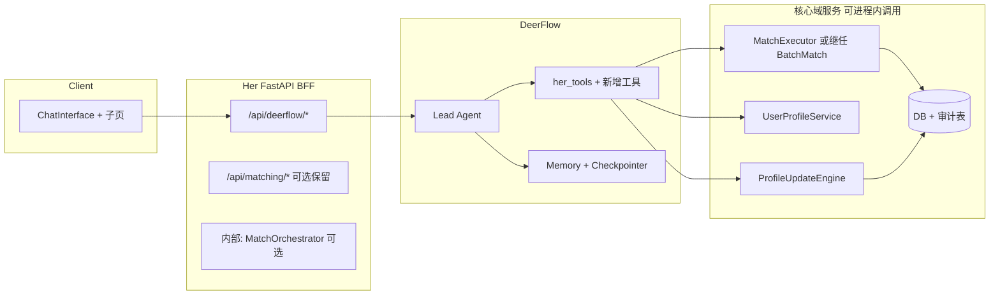

# Her 顾问链 → DeerFlow 替代路线图

> 目的：在**不中断线上业务**的前提下，把「用户入口 + 编排逻辑」逐步收敛到 **DeerFlow Agent**，同时保留或下沉 **确定性匹配、审计落库、降级** 能力。  
> 前置阅读：[主路径收敛（IMP-001）](GOLDEN_PATH_SOLUTION.md)（用户心智与入口策略）。

---

## 0. 目标与非目标

### 0.1 目标（12～18 个月可分段完成）

1. **用户侧**：主对话仅感知 **一个**「Her」（DeerFlow 线程 + Memory + 工具），减少「聊天走 DeerFlow、列表又走另一套」的认知分裂。  
2. **工程侧**：`/api/her/*` 与 `ConversationMatchService.process_message` **可下线或变为内部 RPC**，对外 OpenAPI 以 `/api/deerflow/*` + 必要 BFF 为主。  
3. **能力侧**：现有 Her 独有能力（行为事件、知识案例、并行打分、落库）**有等价物**（工具 / 子服务 / 事件总线），并有评测与监控。

### 0.2 非目标（本路线图不承诺）

- 一次性删除所有 Python 编排而不做替代（会导致 `/api/matching`、降级、落库断裂）。  
- 让「纯 Agent 自由发挥」完全替代「固定状态机」而不做护栏与评测。

---

## 1. 现状快照（迁移起点）

| 层级 | 现状 |
|------|------|
| 用户主聊天 | 前端 `ChatInterface` 以 **`deerflowClient`** 为主（[frontend/src/components/ChatInterface.tsx](../frontend/src/components/ChatInterface.tsx)）。 |
| Her HTTP | [`src/api/her_advisor.py`](../src/api/her_advisor.py)：`/chat`、`/analyze-bias`、`/match-advice`、`/profile`、`/behavior-event`、`/knowledge-cases`、`/health`。 |
| 编排内核 | [`ConversationMatchService`](../src/services/conversation_match_service.py)：`IntentAnalyzer` → `QueryQualityChecker` → 偏差 → `MatchExecutor`（并行 `generate_match_advice`）→ `AdviceGenerator` → `UIBuilder`。 |
| 列表/REST 匹配 | [`src/api/matching.py`](../src/api/matching.py)：`MatchExecutor` / `HerAdvisorService` / 缓存；部分路径调用 `get_conversation_match_service()`（需与实现保持同步）。 |
| DeerFlow 工具 | [`deerflow/config.yaml`](../deerflow/config.yaml) 当前仅注册 **5** 个工具：`her_get_profile`、`her_find_candidates`、`her_get_conversation_history`、`her_update_preference`、`her_create_profile`。`feedback_tools` 等未注册。 |
| 降级 | [`src/api/deerflow.py`](../src/api/deerflow.py) 在 DeerFlow 不可用时调用 **`ConversationMatchService`**。 |

---

## 2. 目标架构（迁移终点示意）

**原则**：Agent 负责「对话与决策」；**重计算、强事务、并行 LLM** 尽量落在 **工具实现或服务方法** 内，避免只靠模型多轮闲聊复现 `MatchExecutor` 行为。

---

## 3. 分阶段路线图

### 阶段 0：对齐与度量（1～2 周）

| 任务 | 产出 |
|------|------|
| 盘点 **谁还在调** `/api/her/*`、`conversationMatchingApi.match`、直连 `MatchExecutor` 的脚本/客户端 | 调用矩阵表（路径、QPS、是否可删） |
| 定义 **唯一对外契约**：DeerFlow 响应里 `generative_ui` / `tool_result` 与前端解析对齐文档 | 1 页契约 + 示例 JSON |
| 建立 **对比评测集**：同输入下 Her 编排 vs DeerFlow（候选人数、分数分布、文案长度、耗时） | 20～50 条用例 + 自动化脚本（可先半自动） |
| 监控：DeerFlow **工具失败率、超时、token**；匹配 API **错误率、P99** | Dashboard 或日志查询模板 |

**验收**：团队签字「可开始阶段 1」；无则默认暂缓大删。

---

### 阶段 1：工具补齐（2～4 周）

**目的**：让 DeerFlow **不靠 `/api/her`** 也能完成闭环数据面。

| ID | 任务 | 说明 |
|----|------|------|
| T1.1 | 在 [`deerflow/config.yaml`](../deerflow/config.yaml) 注册 **`her_record_feedback` / `her_get_feedback_history`**（若产品需要反馈闭环） | 代码已在 [`her_tools/__init__.py`](../deerflow/backend/packages/harness/deerflow/community/her_tools/__init__.py)，缺的是配置与联调。 |
| T1.2 | 新增工具 **`her_record_behavior_event`**（或命名一致） | 封装 `ProfileUpdateEngine.process_behavior_event`，替代 `POST /api/her/behavior-event` 的 Agent 侧调用。 |
| T1.3 | 新增工具 **`her_list_knowledge_cases`**（可选） | 封装 `HerKnowledgeCaseDB` 查询，替代 `GET /api/her/knowledge-cases`；或改为静态知识注入 Memory。 |
| T1.4 | 评估 **`her_find_candidates` 与 `MatchExecutor._query_candidate_pool` 是否一致** | 不一致则：要么扩展 find_candidates 参数/过滤，要么新增 **`her_match_candidates_batch`** 内部直接调 `MatchExecutor.execute_matching` 返回原始列表（Agent 只解读）。 |

**验收**：DeerFlow 在集成环境可完成「画像 → 找人 →（可选）反馈 → 行为更新」全链路 demo；无 500。

---

### 阶段 2：编排下沉（BFF 化）（4～8 周）

**目的**：把 `ConversationMatchService.process_message` 的**确定性步骤**变成 **可被 DeerFlow 调用的一个内部服务**（不必再暴露 HTTP）。

| ID | 任务 | 说明 |
|----|------|------|
| T2.1 | 抽取 **`MatchOrchestrator`**（命名可议） | 入参：`user_id, message, history`；出参：与现 `HerChatResponse` 对齐的 DTO 或子集；实现可**复用** `IntentAnalyzer`、`QueryQualityChecker`、`MatchExecutor`、`AdviceGenerator`、`UIBuilder`。 |
| T2.2 | 新增 **仅内部使用** 的调用入口 | 例如 `POST /api/deerflow/internal/match-step` **禁止外网**（mTLS / localhost / service token），供将来「超弱模型」走服务端编排；**或**直接在 `deerflow.py` 同进程 `import` 调用 `MatchOrchestrator`（更简单）。 |
| T2.3 | **DeerFlow 系统 Prompt** 约定 | 匹配意图时优先调 `her_find_candidates` / 批量工具；**禁止**编造用户 ID；输出必须带可渲染 `generative_ui` 时遵循 schema。 |
| T2.4 | **`deerflow.py` 降级策略** 重写 | DeerFlow 失败时：先重试 → 再 **同步调用 `MatchOrchestrator` 简化版**（仅返回文本 + 候选 id），避免长链路仍依赖已废弃 HTTP。 |

**验收**：DeerFlow 与 Orchestrator 双跑对比评测集，**关键指标不低于阶段 0 基线**（可允许文案差异，需产品确认）。

---

### 阶段 3：API 收敛与废弃（4～6 周，与阶段 2 可部分并行）

| ID | 任务 | 说明 |
|----|------|------|
| T3.1 | 前端：**移除或标记废弃** `herAdvisorApi` 在业务路径的调用 | 若已无调用，删除死代码；[`index.ts`](../frontend/src/api/index.ts) 中 `conversationMatchingApi.match` 与文档对齐。 |
| T3.2 | `/api/her/*`：**先 Deprecated**（响应头或文档），监控 4 周流量为 0 再删 | 保留 `analyze-bias` / `match-advice` 若仍有运营/脚本依赖，可合并到 `deerflow` BFF 单端点。 |
| T3.3 | **`/api/matching`**：决策 | **方案 A**：保留 REST，内部只调 `MatchOrchestrator`/`MatchExecutor`（无 UI 依赖）；**方案 B**：改为内部服务 + 仅 DeerFlow 触达；需产品确认是否有非 App 客户端。 |
| T3.4 | 更新 **OpenAPI / SYSTEM_DOC / 本路线图** 状态 | 避免「文档说唯一入口是 /api/her」与代码不一致。 |

**验收**：生产环境 `/api/her` 流量为 0 或仅灰度账号；无未知 404。

---

### 阶段 4：瘦身与治理（持续）

- 删除已无引用的 `her_advisor.py` 路由模块（或整文件），**保留** `HerAdvisorService` 内仍被 `MatchExecutor` / `matching.py` 使用的 **纯 LLM 方法**（或改名为 `MatchScoringService`）。  
- 将 `IntentAnalyzer` / `QueryQualityChecker` 是否迁入「仅 Orchestrator 使用」或改为 **轻量规则 + 一次 LLM** 做成本优化。  
- **向量 / hybrid** 与 DeerFlow `her_find_candidates` 对齐（参见 [VECTOR_MATCH_SYSTEM_DESIGN.md](VECTOR_MATCH_SYSTEM_DESIGN.md)）。

---

## 4. 风险登记与缓解

| 风险 | 缓解 |
|------|------|
| Agent 行为漂移 | 阶段 0 评测集 + 阶段 2 Prompt/工具版本化；关键路径 **工具返回结构化 JSON**。 |
| 延迟与成本上升 | 批量工具内并行 LLM；Agent 侧限制工具轮数；弱模型走 T2.2 内部编排。 |
| 落库审计缺失 | T1.x 工具显式写 DB；或 Middleware 监听 tool 结果写审计表。 |
| 团队并行改两处 | 阶段 3 前冻结「Her HTTP 行为」；新需求只加 DeerFlow 侧。 |

---

## 5. 里程碑检查清单（自检）

- [ ] 阶段 0：调用矩阵 + 评测基线 + 契约文档完成  
- [ ] 阶段 1：`config.yaml` 工具与行为/反馈/知识（按需）联调通过  
- [ ] 阶段 2：`MatchOrchestrator` 可被 DeerFlow 同进程调用；降级不依赖废弃 HTTP  
- [ ] 阶段 3：`/api/her` 流量归零；前端无死链  
- [ ] 阶段 4：代码与文档命名一致（HerAdvisor vs MatchScoring 等）

---

## 6. 修订记录

| 日期 | 说明 |
|------|------|
| 2026-04-21 | 初版：分阶段替代路线图（工具 → 编排下沉 → API 废弃 → 瘦身） |
