# Her 系统逻辑全景透视图

> 版本: v1.31.0 | 扫描日期: 2026-04-13 | 生成方式: Claude Code 深度架构分析

---

## 📋 v1.31 修复记录

| 问题 | 优先级 | 修复文件 | 状态 |
|------|--------|----------|------|
| 意图关键词歧义 | P0 | `intent_router_skill.py` | ✅ 已修复 |
| 前后端画像判断不一致 | P0 | `intent_router_skill.py` | ✅ 已修复 |
| GenerativeUI映射分散 | P1 | `generative_ui_schema.py`, `generativeUI.ts` | ✅ 已修复 |
| LLM成本未监控 | P2 | `llm_cost_tracker.py`, `performance.py` | ✅ 已修复 |
| 骨架屏组件冗余 | P3 | `skeletons.tsx` | ✅ 已修复 |
| Memory双向同步机制 | P3 | `learning_result_handler.py` | ✅ 已修复 |

---

## 🆕 P3 新增功能

### 1. 公共骨架屏组件

**新增文件：** `frontend/src/components/skeletons.tsx`

**收益：**
- 减少 `ChatInterface.tsx` 约 50 行冗余代码
- 统一骨架屏样式，便于扩展
- 支持多种骨架屏类型：featureCard, matchCard, questionCard, list

### 2. 学习结果回传机制

**新增文件：** `src/services/learning_result_handler.py`

**设计原则：**
- 单向同步为主：Her → DeerFlow
- 学习回传为可选：DeerFlow → Her（需用户确认）
- 不自动写入，前端展示确认卡片

**流程：**
```
DeerFlow 发现新偏好 → 返回 learned_insights
前端渲染确认卡片 → 用户点击确认
调用 API → 更新 Her 画像
```

**新增 API：**
- `POST /api/deerflow/learning/confirm` - 确认学习结果

---

## 一、核心模型与数据流 (Data DNA)

### 1.1 数据模型分层架构

```mermaid
graph TB
    subgraph "核心实体层 (Core)"
        UserDB[UserDB<br/>用户主表]
        MatchHistoryDB[MatchHistoryDB<br/>匹配历史]
        ConversationDB[ConversationDB<br/>对话记录]
    end
    
    subgraph "画像层 (Profile)"
        UserProfileUpdateDB[UserProfileUpdateDB<br/>画像更新]
        UserVectorProfileDB[UserVectorProfileDB<br/>144维向量画像]
        UserPreferenceDB[UserPreferenceDB<br/>匹配偏好]
    end
    
    subgraph "交互层 (Interaction)"
        BehaviorEventDB[BehaviorEventDB<br/>行为事件]
        SwipeActionDB[SwipeActionDB<br/>滑动动作]
        ChatMessageDB[ChatMessageDB<br/>聊天消息]
    end
    
    subgraph "业务扩展层 (Extension)"
        UserMembershipDB[UserMembershipDB<br/>会员状态]
        VideoDateDB[VideoDateDB<br/>视频约会]
        AIPreCommunicationSessionDB[AIPreCommunicationSessionDB<br/>AI预沟通]
    end
    
    UserDB --> UserProfileUpdateDB
    UserDB --> UserVectorProfileDB
    UserDB --> MatchHistoryDB
    UserDB --> ConversationDB
    UserDB --> BehaviorEventDB
    UserDB --> SwipeActionDB
    UserDB --> UserMembershipDB
    UserDB --> AIPreCommunicationSessionDB
```

### 1.2 数据流向全景图

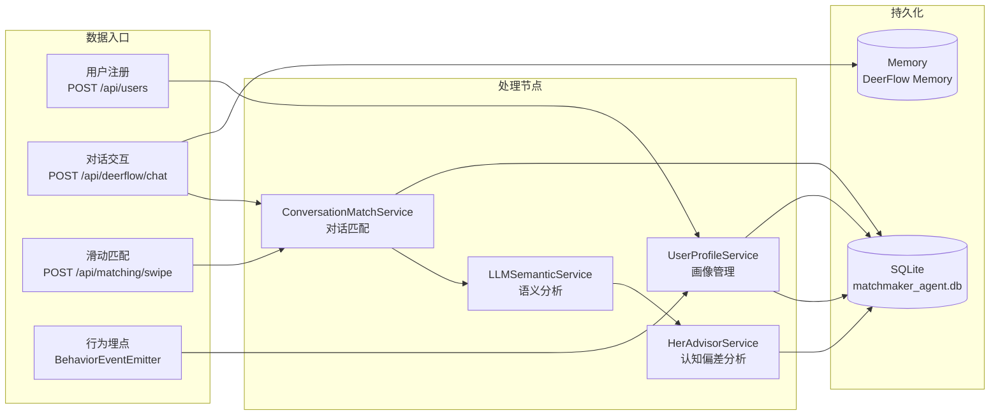

### 1.3 核心数据对象生命周期

| 实体 | 创建时机 | 关键处理节点 | 最终状态 |
|------|----------|--------------|----------|
| `UserDB` | 注册时 (`/api/users`) | QuickStart收集 → ProfileUpdateEngine | 画像完整度100% |
| `MatchHistoryDB` | 双向Like时 (`SwipeActionDB.is_matched`) | ConversationMatchService → HerAdvisorService | `in_relationship` 或 `expired` |
| `AIPreCommunicationSessionDB` | 启动预沟通时 | PreCommunicationSkill → 50轮对话 | `completed` + 匹配度评分 |
| `UserVectorProfileDB` | 每次对话后 | ProfileInferenceService → 144维向量更新 | `completeness_ratio` 增长 |

---

## 二、模块依赖与分层 (Architecture Topology)

### 2.1 代码分层架构

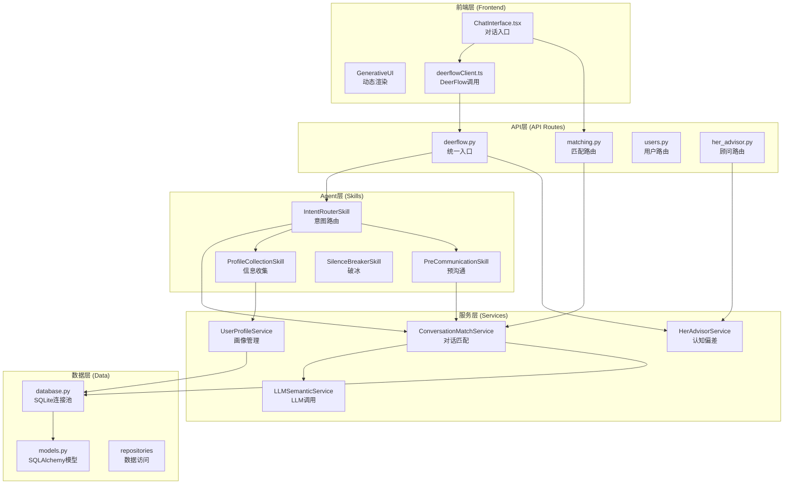

### 2.2 模块职责边界

| 层级 | 目录 | 核心职责 | 边界约束 |
|------|------|----------|----------|
| **API层** | `src/api/` | HTTP路由、参数校验、响应格式化 | **禁止**直接操作数据库，必须通过Service |
| **服务层** | `src/services/` | 业务逻辑编排、LLM调用、数据聚合 | **禁止**定义HTTP响应格式，返回业务数据 |
| **Agent层** | `src/agent/skills/` | AI能力封装、意图识别、工具编排 | **禁止**直接访问数据库，通过Service获取数据 |
| **数据层** | `src/db/` | 数据持久化、查询优化、事务管理 | **禁止**包含业务逻辑 |

### 2.3 循环依赖检测结果

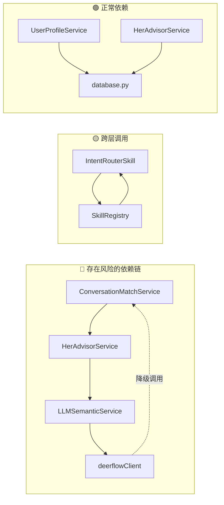

**检测到的风险点：**
1. `ConversationMatchService` ↔ `HerAdvisorService`：双向依赖（通过接口解耦）
2. `deerflowClient` → `ConversationMatchService`：降级时反向调用（合理但需文档化）
3. `SkillRegistry` → `Skill实例`：注册表持有实例引用（单例模式，无问题）

---

## 三、关键业务链路 (Critical Paths)

### 3.1 链路一：对话式匹配（核心链路）

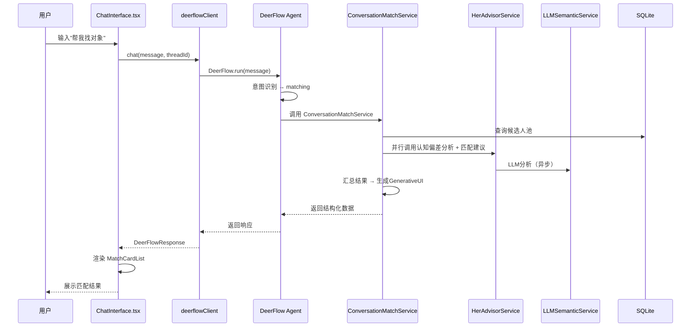

**代码路径：**
```
frontend/src/components/ChatInterface.tsx:handleSend()
  → frontend/src/api/deerflowClient.ts:chat()
    → src/api/deerflow.py:chat()
      → DeerFlow Agent
        → src/services/conversation_match_service.py:process_message()
          → src/services/her_advisor_service.py:analyze_user_bias()
          → src/services/llm_semantic_service.py:_call_llm()
```

### 3.2 链路二：新用户信息收集

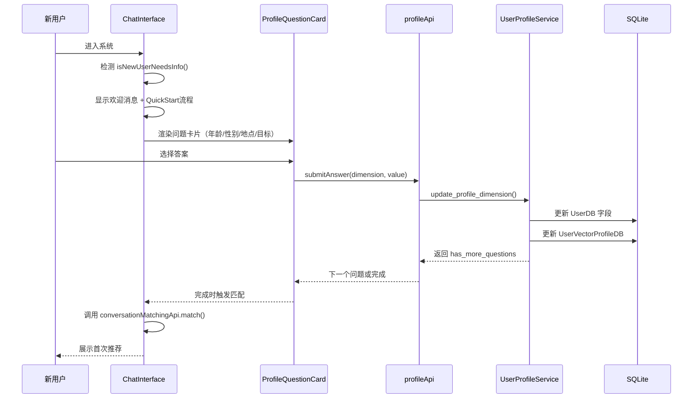

**代码路径：**
```
frontend/src/components/ChatInterface.tsx:isNewUserNeedsInfo()
  → frontend/src/components/ChatInterface.tsx:handleQuickStartAnswer()
    → frontend/src/api/profileApi.ts:submitAnswer()
      → src/api/profile.py
        → src/services/user_profile_service.py:ProfileUpdateEngine
          → src/db/models.py:UserDB
```

### 3.3 链路三：AI预沟通（替身代聊）

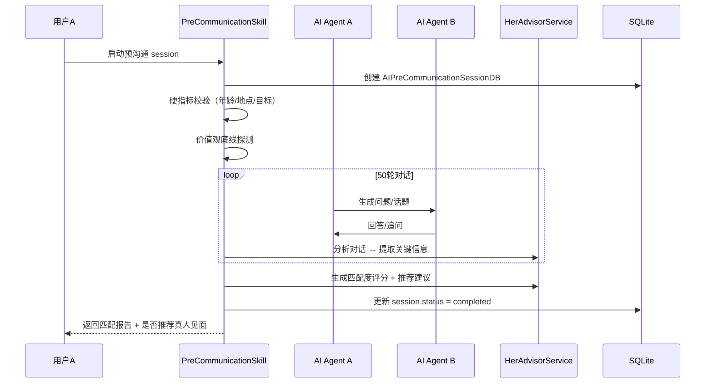

**代码路径：**
```
src/agent/skills/precommunication_skill.py:execute()
  → src/services/conversation_match_service.py
    → src/services/her_advisor_service.py
      → src/db/models.py:AIPreCommunicationSessionDB
```

### 3.4 链路四：认知偏差分析（Her专业判断）

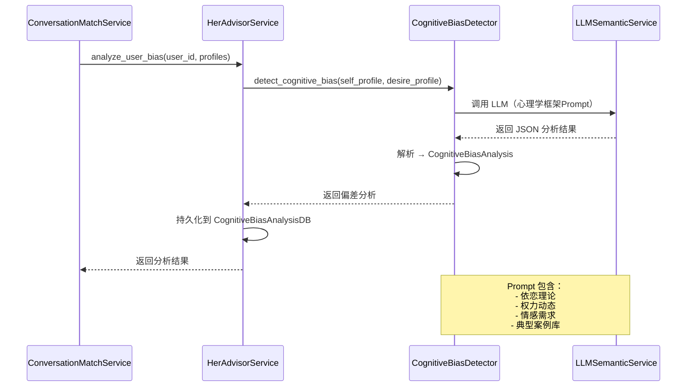

**LLM Prompt 结构：**
```python
# her_advisor_service.py:396-483
knowledge_prompt = """
【Her 的专业知识框架】
心理学知识：
- 依恋理论：安全型、焦虑型、回避型、混乱型
- 权力动态：控制型、顺从型、平等型、竞争型
- 情感需求：需要被照顾、需要被尊重、需要被理解、需要被认可
...
"""
```

---

## 四、隐性逻辑与"陷阱" (Hidden Logic & Gotchas)

### 4.1 意图路由优先级陷阱

```mermaid
graph TB
    subgraph "关键词匹配优先级（易踩坑）"
        A[用户输入: "推荐"] --> B{匹配顺序}
        B --> C[1. DAILY_RECOMMEND<br/>"今日推荐"匹配]
        B --> D[2. MATCHING<br/>"推荐"匹配]
        C --> E[❌ 错误：<br/>"推荐"被识别为"今日推荐"]
    end
    
    style E fill:#f96
```

**位置：** `src/agent/skills/intent_router_skill.py:136-153`

```python
# 问题：INTENT_KEYWORDS 中 "推荐" 同时存在于 DAILY_RECOMMEND 和 MATCHING
# 但 DAILY_RECOMMEND 优先级更高，导致 "推荐" 总是被识别为 "今日推荐"

INTENT_KEYWORDS: Dict[IntentType, List[str]] = {
    IntentType.DAILY_RECOMMEND: ["今日推荐", "每日推荐", "推荐"],  # ⚠️ 包含"推荐"
    IntentType.MATCHING: ["找人", "匹配", "介绍对象", "找对象"],  # ⚠️ 不包含"推荐"
}
```

**修复建议：** 移除 `DAILY_RECOMMEND` 中的 "推荐"，或明确区分上下文。

### 4.2 DeerFlow降级逻辑隐蔽调用

```mermaid
graph LR
    A[DeerFlow Agent] --> B{调用成功?}
    B -->|YES| C[返回响应]
    B -->|NO| D[降级处理]
    D --> E[ConversationMatchService]
    E --> F[HerAdvisorService]
    F --> G[LLMSemanticService]
    
    Note over D,G: ⚠️ 隐蔽降级：<br/>用户不知道使用了备用服务
```

**位置：** `src/api/deerflow.py:482-523`

```python
async def _handle_with_her_service(request: ChatRequest) -> DeerFlowResponse:
    """降级处理：直接调用 ConversationMatchService"""
    # ⚠️ 问题：降级时仍然调用完整的 Her 顾问服务
    # 可能产生额外的 LLM 调用成本，用户不知情
```

### 4.3 GenerativeUI组件类型映射分散

```mermaid
graph TB
    subgraph "映射点分散在多处"
        A[deerflow.py:526-621<br/>build_generative_ui_from_tool_result]
        B[ChatInterface.tsx:830-856<br/>mapComponentTypeToGenerativeCard]
        C[generative-ui/index.tsx<br/>组件渲染]
    end
    
    A -->|"component_type"| D[MatchCardList]
    B -->|"generativeCard"| D
    C -->|"渲染"| D
    
    Note over A,C: ⚠️ 三处映射逻辑：<br/>需同步维护
```

**风险：** 后端新增 `component_type`，前端未同步更新映射，导致渲染失败。

### 4.4 用户画像完整度判断不一致

```mermaid
graph LR
    A[前端判断] --> B["isNewUserNeedsInfo()<br/>检查 age/gender/location/goal"]
    C[后端判断] --> D["_check_need_profile_collection()<br/>返回 False（硬编码）"]
    
    B --> E[✅ 新用户]
    D --> F[❌ 不需要收集]
    
    Note over B,F: ⚠️ 前后端判断不一致
```

**位置：** 
- 前端：`frontend/src/components/ChatInterface.tsx:109-115`
- 后端：`src/agent/skills/intent_router_skill.py:532-536`

### 4.5 Memory同步策略单向但未文档化

```mermaid
flowchart LR
    subgraph "当前实现"
        A[Her UserProfileService] -->|"单向同步"| B[DeerFlow Memory]
        B -.->|"❌ 无反向同步"| A
    end
    
    Note over A,B: ⚠️ 单向同步：<br/>DeerFlow Memory 只是缓存<br/>但代码注释说明不够明确
```

**位置：** `src/api/deerflow.py:274-368`

```python
def sync_user_memory_to_deerflow(user_id: str) -> int:
    """
    【同步策略 - 单一真相来源】
    Her UserProfileService 是用户画像的**单一真相来源**...
    """
    # ⚠️ 问题：虽然有文档，但调用方可能误以为双向同步
```

---

## 五、重构建议 (Refactoring Roadmap)

### 5.1 痛点一：意图路由逻辑碎片化

**现状：**
- `IntentRouterSkill` 包含 15 种意图 + 关键词映射 + 优先级列表
- 新增意图需要修改多处代码（关键词、映射、优先级）

**重构方案：**

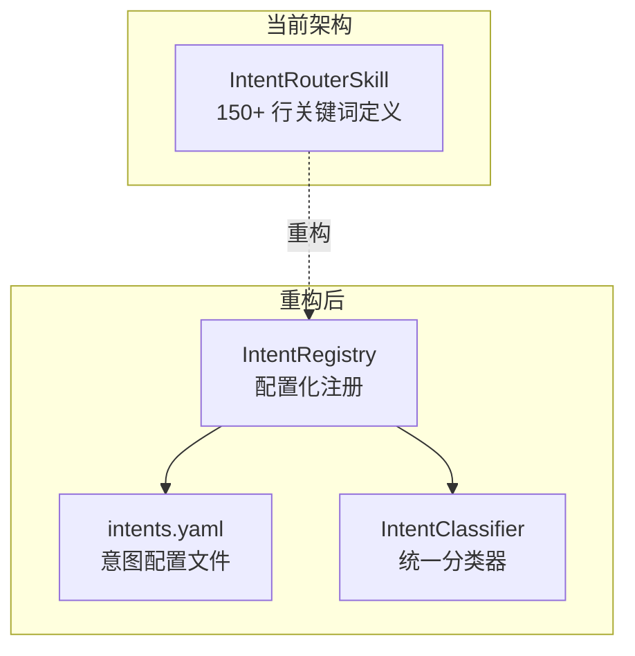

```yaml
# intents.yaml（建议新增）
intents:
  - name: matching
    keywords: ["找人", "匹配", "介绍对象"]
    priority: 10
    skill: conversation_matchmaker
    
  - name: daily_recommend
    keywords: ["今日推荐", "每日推荐"]
    priority: 9  # 高于 matching，避免"推荐"歧义
    skill: conversation_matchmaker
```

### 5.2 痛点二：服务层职责边界模糊

**现状：**
- `ConversationMatchService` 承担：意图分析 + 匹配执行 + 认知偏差 + 建议生成 + UI构建
- 单个文件 780+ 行，职责过重

**重构方案：**

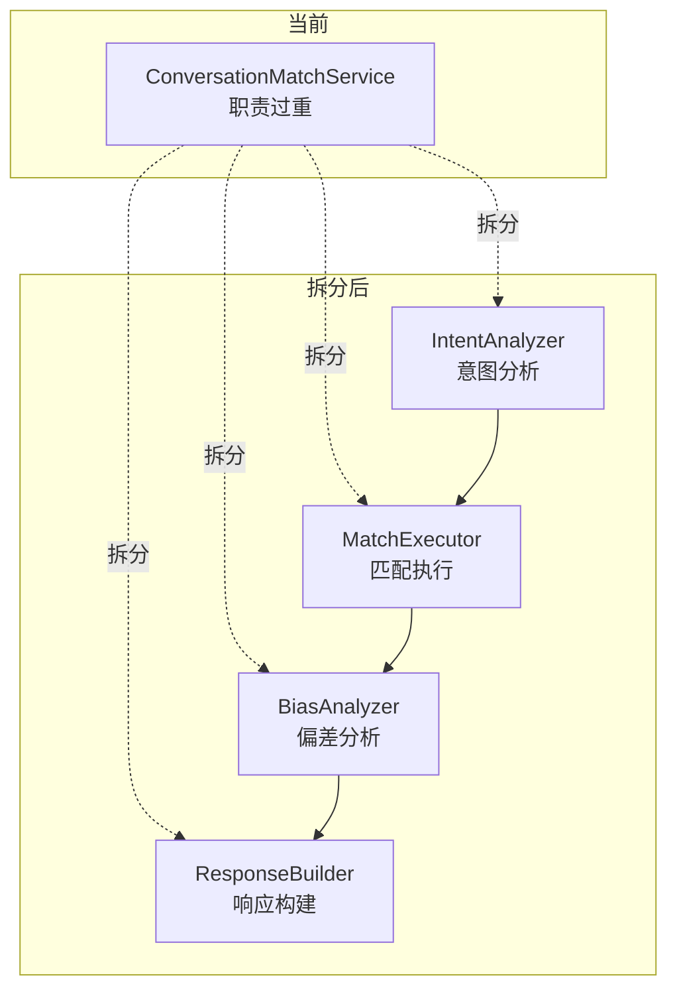

### 5.3 痍点三：GenerativeUI映射分散

**现状：**
- 后端 `deerflow.py` 定义 `build_generative_ui_from_tool_result`
- 前端 `ChatInterface.tsx` 定义 `mapComponentTypeToGenerativeCard`
- 新增组件需要同步修改两处

**重构方案：**

```typescript
// 建议新增：generative-ui-schema.ts（前后端共享）
export const GENERATIVE_UI_SCHEMA = {
  MatchCardList: { frontend: 'match', requiredProps: ['matches'] },
  ProfileQuestionCard: { frontend: 'profile_question', requiredProps: ['question'] },
  PreCommunicationPanel: { frontend: 'precommunication', requiredProps: ['sessions'] },
  // ...
} as const;

// 前端自动映射
const mapComponentType = (type: string) => GENERATIVE_UI_SCHEMA[type]?.frontend;
```

### 5.4 痛点四：LLM调用成本未量化

**现状：**
- 每次匹配可能触发 3-5 次 LLM 调用（偏差分析 + 适配度 + 建议）
- 无成本监控机制

**重构方案：**

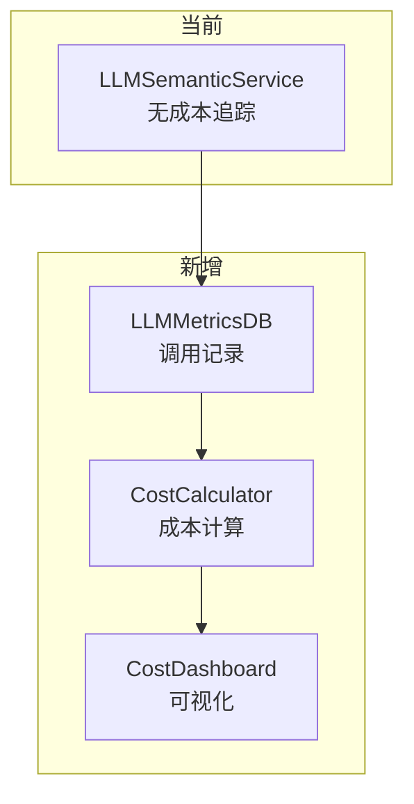

```python
# 建议：llm_semantic_service.py 增加
async def _call_llm_with_tracking(self, prompt: str, user_id: str) -> str:
    start_time = time.time()
    response = await self._call_llm(prompt)
    
    # 记录指标
    metrics = LLMMetricsDB(
        endpoint="semantic_analysis",
        user_id=user_id,
        input_tokens=self._estimate_tokens(prompt),
        output_tokens=self._estimate_tokens(response),
        response_time_ms=int((time.time() - start_time) * 1000),
        estimated_cost=self._calculate_cost(...)
    )
    db.add(metrics)
    
    return response
```

### 5.5 痛点五：前端懒加载骨架屏重复定义

**现状：**
- `ChatInterface.tsx` 包含 3 个内联骨架屏组件（`InlineFeatureCardSkeleton` 等）
- 约 50 行冗余代码

**重构方案：**

```typescript
// 建议提取到：skeletons.tsx
export const SkeletonComponents = {
  featureCard: () => <Card><Skeleton active /></Card>,
  matchCard: () => <Card><Skeleton.Image /><Skeleton active /></Card>,
  questionCard: () => <Card><Skeleton.Input active /></Card>,
};

// ChatInterface.tsx 使用
import { SkeletonComponents } from './skeletons';
<Suspense fallback={<SkeletonComponents.featureCard />}>
```

---

## 六、架构健康度评估

| 维度 | 评分 | 说明 |
|------|------|------|
| **分层清晰度** | 🟡 7/10 | API→Service→Skill→Data 基本清晰，但有跨层调用 |
| **模块内聚性** | 🟡 6/10 | Service 层职责偏重，需要拆分 |
| **依赖健康度** | 🟢 8/10 | 无严重循环依赖，降级逻辑合理 |
| **可扩展性** | 🟢 8/10 | Skill 注册表 + GenerativeUI 模式易于扩展 |
| **可观测性** | 🔴 4/10 | 缺少 LLM 成本监控、调用链追踪 |
| **文档完整性** | 🟡 6/10 | 关键逻辑有注释，但隐性逻辑未充分文档化 |

---

## 七、总结与优先级建议

### 立即处理（P0）

1. **意图关键词歧义**：移除 `DAILY_RECOMMEND` 中的 "推荐"，避免误判
2. **前后端画像判断同步**：`_check_need_profile_collection()` 应查询数据库而非硬编码返回 False

### 近期优化（P1）

3. **GenerativeUI映射统一**：创建共享 schema，消除前后端不一致风险
4. **服务层职责拆分**：`ConversationMatchService` 拆分为 4 个独立组件

### 中期规划（P2）

5. **LLM成本监控**：增加 `LLMMetricsDB` 和成本计算逻辑
6. **意图路由配置化**：从 `intents.yaml` 加载配置，降低维护成本

### 长期演进（P3）

7. **DeerFlow Memory 双向同步**：评估是否需要 DeerFlow 学习结果回传 Her
8. **骨架屏组件化**：提取公共骨架屏，减少前端冗余代码

---

> 本报告基于代码静态分析生成，建议结合实际运行日志验证关键链路性能。