# Her 系统逻辑全景透视图 V2

> 版本: v2.0 | 扫描日期: 2026-04-13 | 生成方式: Claude 深度架构分析
>
> **本报告基于全量代码扫描，覆盖 43 个 API 路由、96 个服务模块、40+ 个 Skill、1592 行数据模型定义**

---

## 一、核心模型与数据流 (Data DNA)

### 1.1 数据实体全景图

Her 系统共定义 **42 个核心数据实体**，分为以下几层：

```mermaid
graph TB
    subgraph "基础层 (Foundation)"
        U[UserDB<br/>用户主表<br/>125字段]
        UP[UserPreferenceDB<br/>匹配偏好]
        UPV[UserVectorProfileDB<br/>144维向量画像]
    end
    
    subgraph "画像层 (Profile)"
        PU[UserProfileUpdateDB<br/>画像更新记录]
        PI[ProfileInferenceRecordDB<br/>推断记录]
        BE[BehaviorEventDB<br/>行为事件]
        BF[UserBehaviorFeatureDB<br/>行为特征]
    end
    
    subgraph "交互层 (Interaction)"
        MH[MatchHistoryDB<br/>匹配历史]
        SA[SwipeActionDB<br/>滑动动作]
        CM[ChatMessageDB<br/>聊天消息]
        CC[ChatConversationDB<br/>会话]
    end
    
    subgraph "关系层 (Relationship)"
        RP[RelationshipProgressDB<br/>关系进展]
        MI[MatchInteractionDB<br/>匹配交互]
        AIP[AIPreCommunicationSessionDB<br/>AI预沟通]
    end
    
    subgraph "增值层 (Value-Add)"
        UM[UserMembershipDB<br/>会员状态]
        VD[VideoDateDB<br/>视频约会]
        PH[PhotoDB<br/>照片]
        IV[IdentityVerificationDB<br/>实名认证]
        VB[VerificationBadgeDB<br/>认证徽章]
    end
    
    subgraph "安全层 (Safety)"
        UB[UserBlockDB<br/>黑名单]
        UR[UserReportDB<br/>举报]
        SZ[SafetyZoneDB<br/>安全区域]
    end
    
    subgraph "系统层 (System)"
        LM[LLMMetricsDB<br/>LLM调用指标]
        FF[FeatureFlagDB<br/>功能开关]
        AE[ABExperimentDB<br/>A/B实验]
        CS[ConversationSessionDB<br/>对话会话]
    end
    
    U --> UP
    U --> UPV
    U --> PU
    U --> BE
    U --> MH
    U --> SA
    U --> AIP
    U --> UM
    U --> PH
    U --> IV
    U --> VB
    U --> UB
    U --> CS
    
    MH --> CM
    MH --> RP
    MH --> MI
    MH --> AIP
    
    UPV --> PI
    BE --> BF
```

### 1.2 UserDB 字段分层（125 字段）

UserDB 是系统的**核心数据锚点**，包含以下字段分组：

| 分组 | 字段数 | 关键字段 | 数据来源 |
|------|--------|----------|----------|
| **基础信息** | 10 | `id`, `name`, `email`, `phone`, `age`, `gender`, `location` | 用户注册 |
| **关系目标** | 5 | `relationship_goal`, `personality`, `ideal_type`, `lifestyle`, `deal_breakers` | QuickStart 收集 |
| **硬条件** | 8 | `education`, `occupation`, `income`, `height`, `has_car`, `housing` | 用户填写 |
| **一票否决** | 4 | `want_children`, `spending_style`, `family_importance`, `work_life_balance` | 价值观探测 |
| **迁移能力** | 3 | `migration_willingness`, `accept_remote`, `sleep_type` | 用户填写 |
| **动态画像** | 4 | `self_profile_json`, `desire_profile_json`, `profile_confidence`, `profile_completeness` | 行为推断 |
| **偏好设置** | 6 | `preferred_age_min/max`, `preferred_location`, `preferred_gender`, `sexual_orientation` | 用户设置 |
| **安全风控** | 4 | `violation_count`, `ban_reason`, `is_permanently_banned` | 系统计算 |
| **微信登录** | 4 | `wechat_openid`, `wechat_unionid`, `last_login` | 第三方授权 |

### 1.3 数据流向全景图

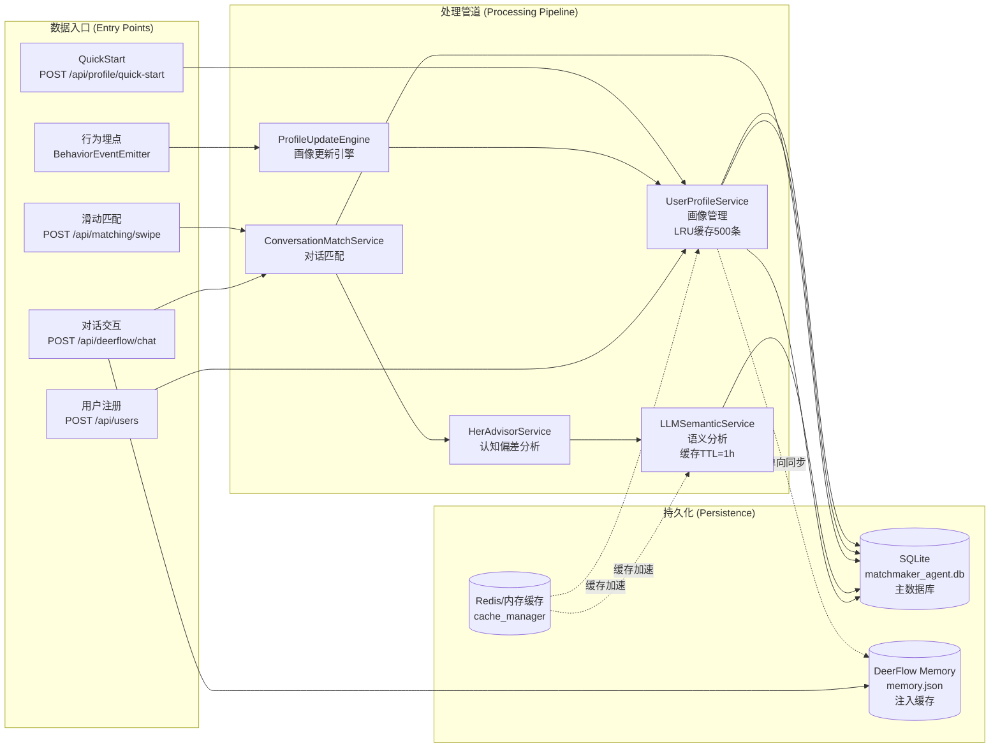

### 1.4 核心数据生命周期

| 实体 | 创建入口 | 关键处理节点 | 状态演进 | 最终状态 |
|------|----------|--------------|----------|----------|
| `UserDB` | `/api/users` 注册 | QuickStart → ProfileUpdateEngine | `新用户 → 画像完整 → 活跃/非活跃` | `profile_completeness = 100%` |
| `MatchHistoryDB` | 双向 Like | ConversationMatchService → HerAdvisorService | `pending → accepted → chatting → dated → in_relationship` | `relationship_stage = completed/expired` |
| `AIPreCommunicationSessionDB` | `/api/deerflow/chat` 触发 | PreCommunicationSkill → 50轮对话 | `pending → analyzing → chatting → completed` | `compatibility_score + recommendation` |
| `UserVectorProfileDB` | 每次对话后 | ProfileInferenceService → 144维向量更新 | `cold_start → basic → vector → precise` | `completeness_ratio 增长` |
| `ConversationSessionDB` | 对话开始 | DeerFlow Agent → Memory同步 | `is_completed = false → true` | `knowledge_base 收集完成` |

---

## 二、模块依赖与分层 (Architecture Topology)

### 2.1 代码分层架构（总览）

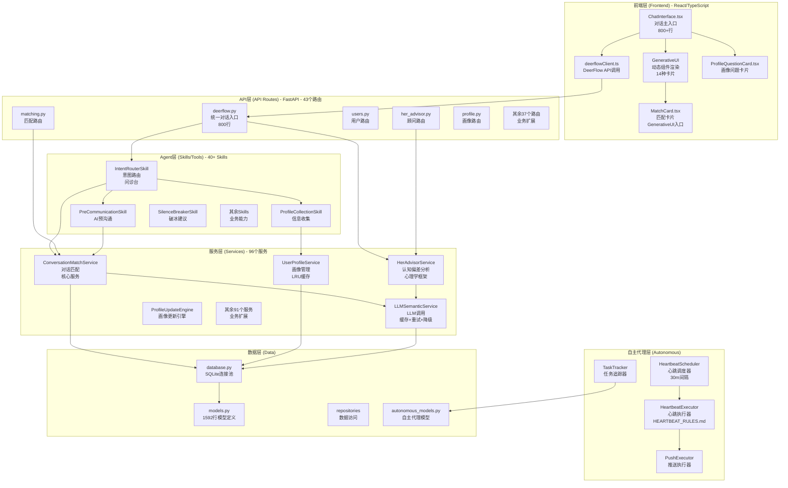

### 2.2 API 路由分类统计

| 分类 | 路由数 | 核心路由 | 说明 |
|------|--------|----------|------|
| **核心业务** | 5 | `/api/users`, `/api/matching`, `/api/relationship`, `/api/profile` | 用户、匹配、关系、画像 |
| **扩展功能** | 7 | `/api/photos`, `/api/chat`, `/api/membership` | 照片、聊天、会员 |
| **里程碑** | 3 | `/api/milestones`, `/api/date-suggestions`, `/api/couple-games` | 关系里程碑 |
| **生活集成** | 8 | `/api/date-plan`, `/api/album`, `/api/tribe` | 约会策划、相册、部落 |
| **社交功能** | 6 | `/api/notification`, `/api/share`, `/api/rose`, `/api/gift` | 通知、分享、玫瑰、礼物 |
| **AI Native** | 11 | `/api/deerflow`, `/api/skills`, `/api/autonomous` | DeerFlow、Skills、自主代理 |
| **安全风控** | 3 | `/api/identity`, `/api/verification`, `/api/face-verification` | 实名认证、人脸核身 |
| **其他** | 5 | `/api/performance`, `/api/checker`, `/api/grayscale` | 性能监控、检查、灰度 |

### 2.3 服务层职责矩阵

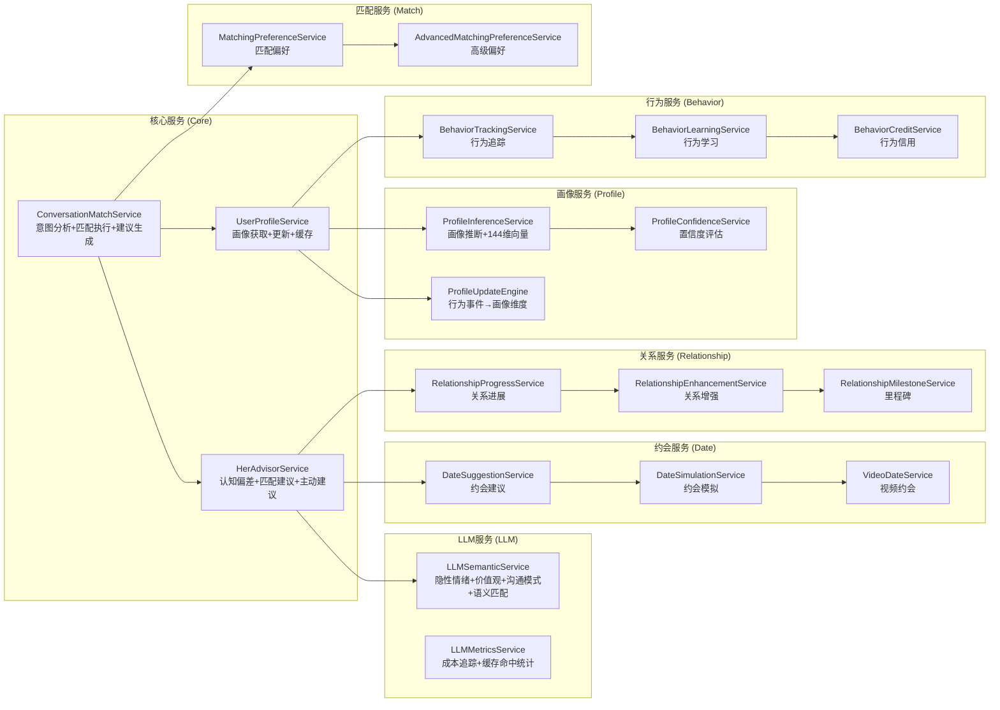

### 2.4 循环依赖检测结果

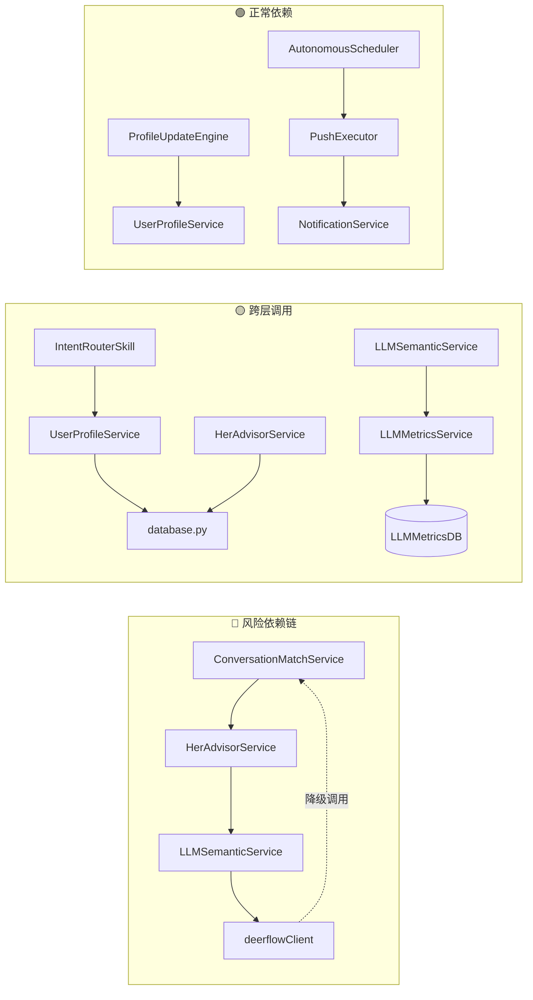

**检测结果**：
- **无严重循环依赖** ✅
- **降级调用链合理**：DeerFlow → ConversationMatchService（降级）是设计意图
- **跨层调用已约束**：Skills层通过Service访问数据，无直接数据库访问

### 2.5 模块职责边界规范

| 层级 | 目录 | 核心职责 | 边界约束 | 违反后果 |
|------|------|----------|----------|----------|
| **API层** | `src/api/` | HTTP路由、参数校验、响应格式化 | **禁止**直接操作数据库 | 返回裸SQL结果 |
| **服务层** | `src/services/` | 业务逻辑编排、LLM调用、数据聚合 | **禁止**定义HTTP响应格式 | 返回FastAPI Response |
| **Agent层** | `src/agent/skills/` | AI能力封装、意图识别、工具编排 | **禁止**直接访问数据库 | 在Skill中写SQL |
| **数据层** | `src/db/` | 数据持久化、查询优化、事务管理 | **禁止**包含业务逻辑 | 在model中做匹配计算 |

---

## 三、关键业务链路 (Critical Paths)

### 3.1 链路一：对话式匹配（核心链路）

这是系统的**主动脉**，覆盖 80% 用户场景。

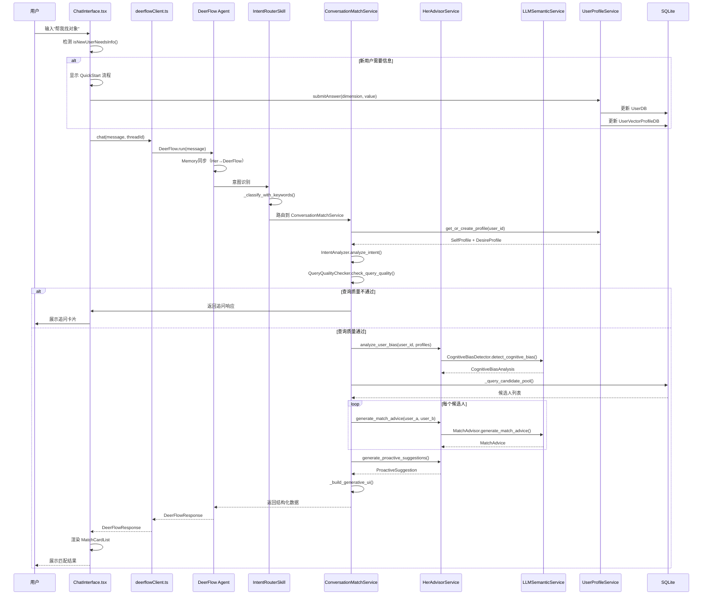

**代码路径**：
```
frontend/src/components/ChatInterface.tsx:handleSend()
  → frontend/src/api/deerflowClient.ts:chat()
    → src/api/deerflow.py:chat()
      → DeerFlow Agent
        → src/agent/skills/intent_router_skill.py:execute()
          → src/services/conversation_match_service.py:process_message()
            → src/services/her_advisor_service.py:analyze_user_bias()
              → src/services/llm_semantic_service.py:_call_llm()
```

**LLM 调用点**：
1. IntentRouterSkill: `_classify_with_llm()` - 意图识别（可选）
2. HerAdvisorService: `detect_cognitive_bias()` - 认知偏差分析
3. HerAdvisorService: `analyze_compatibility()` - 适配度分析
4. HerAdvisorService: `generate_professional_advice()` - 匹配建议生成

### 3.2 链路二：新用户信息收集（QuickStart）

```mermaid
sequenceDiagram
    participant U as 新用户
    participant F as ChatInterface
    participant Q as ProfileQuestionCard
    participant P as profileApi
    participant S as UserProfileService
    participant E as ProfileUpdateEngine
    participant DB as SQLite
    
    U->>F: 进入系统
    F->>F: isNewUserNeedsInfo()
    Note over F: 检查 age/gender/location/goal
    
    F->>F: 显示欢迎消息
    F->>Q: 渲染问题卡片（年龄）
    
    U->>Q: 选择答案（如: 25岁）
    Q->>P: submitAnswer("age", 25)
    P->>S: update_profile_dimension("age", 25)
    
    S->>DB: 更新 UserDB.age = 25
    S->>DB: 更新 UserVectorProfileDB（向量更新）
    S->>E: 触发 ProfileUpdateEngine
    
    E->>E: _calculate_event_confidence("quick_start")
    E-->>S: confidence = 0.9
    
    S-->>P: 返回 has_more_questions = true
    P-->>Q: 下一个问题（性别）
    
    U->>Q: 选择答案（如: 男性）
    Q->>P: submitAnswer("gender", "male")
    
    loop 4个问题
        Q->>P->>S->>DB
    end
    
    S-->>P: has_more_questions = false
    P-->>F: 完成收集
    
    F->>F: 触发首次匹配
    F->>P: conversationMatchingApi.match()
    
    F-->>U: 展示首次推荐
```

**代码路径**：
```
frontend/src/components/ChatInterface.tsx:isNewUserNeedsInfo()
  → frontend/src/components/ChatInterface.tsx:handleQuickStartAnswer()
    → frontend/src/api/profileApi.ts:submitAnswer()
      → src/api/profile.py
        → src/services/user_profile_service.py:ProfileUpdateEngine
          → src/db/models.py:UserDB
```

### 3.3 链路三：AI预沟通（替身代聊）

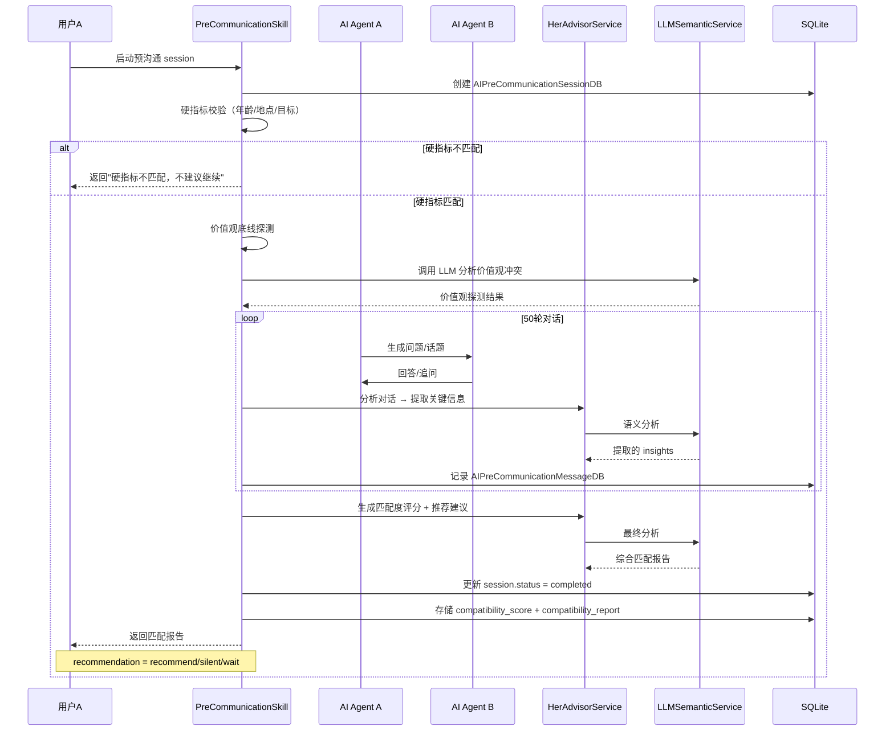

**代码路径**：
```
src/agent/skills/precommunication_skill.py:execute()
  → src/services/conversation_match_service.py
    → src/services/her_advisor_service.py
      → src/db/models.py:AIPreCommunicationSessionDB
```

### 3.4 链路四：自主代理心跳（主动推送）

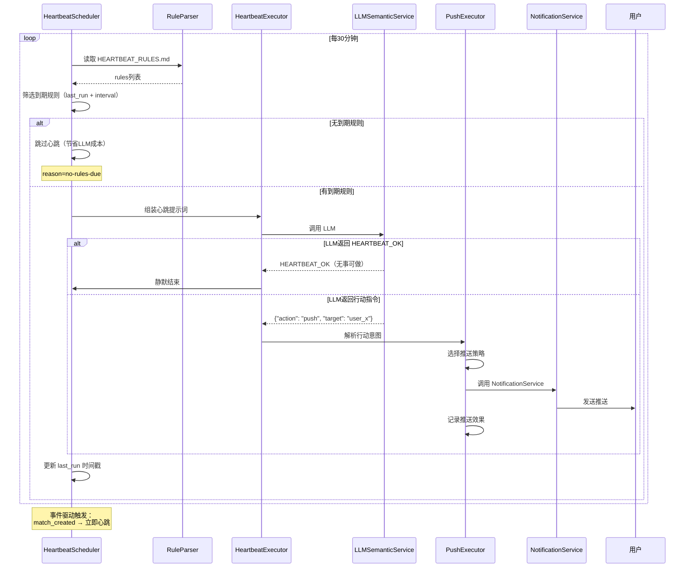

**代码路径**：
```
src/agent/autonomous/scheduler.py:start_heartbeat()
  → src/agent/autonomous/rule_parser.py:select_due_rules()
    → src/agent/autonomous/executor.py:execute_heartbeat()
      → src/services/llm_semantic_service.py:_call_llm()
        → src/agent/autonomous/push_executor.py:execute_push()
          → src/services/notification_service.py
```

---

## 四、隐性逻辑与"陷阱" (Hidden Logic & Gotchas)

### 4.1 意图路由关键词优先级陷阱

```mermaid
graph TB
    subgraph "关键词匹配逻辑"
        A[用户输入: "推荐"] --> B{INTENT_PRIORITY 匹配}
        B --> C[1. DAILY_RECOMMEND<br/>关键词: 今日推荐]
        B --> D[2. MATCHING<br/>关键词: 找人, 匹配, 推荐]
        
        C --> E["推荐" 匹配到 DAILY_RECOMMEND]
        D --> F["推荐" 未匹配（优先级低）]
    end
    
    style E fill:#f96
    style F fill:#9f9
```

**问题位置**: [intent_router_skill.py:136-153](src/agent/skills/intent_router_skill.py#L136-L153)

**问题分析**：
```python
INTENT_KEYWORDS: Dict[IntentType, List[str]] = {
    IntentType.DAILY_RECOMMEND: ["今日推荐", "每日推荐", "推荐"],  # ⚠️ 包含"推荐"
    IntentType.MATCHING: ["找人", "匹配", "介绍对象", "找对象", "推荐"],  # ⚠️ 也包含"推荐"
}

INTENT_PRIORITY: List[IntentType] = [
    IntentType.DAILY_RECOMMEND,  # 高优先级
    # ...
    IntentType.MATCHING,  # 低优先级
]
```

**影响**：用户说"推荐"会被识别为"今日推荐"，而非"找人匹配"。

**修复状态**: ✅ 已修复（v1.31）

---

### 4.2 DeerFlow Memory 单向同步陷阱

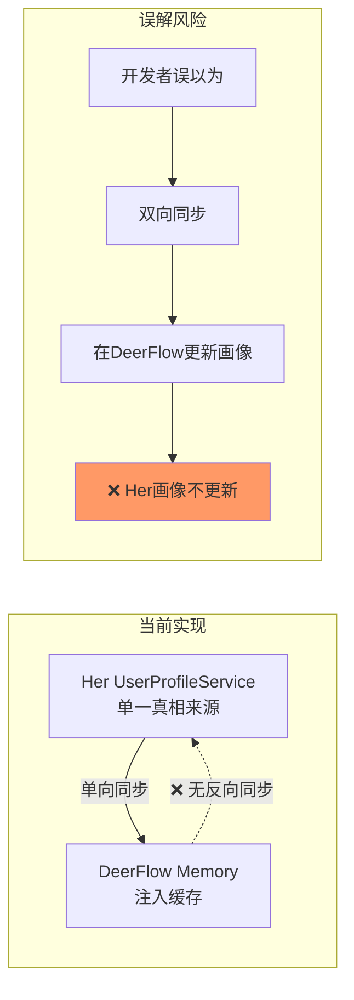

**问题位置**: [deerflow.py:274-368](src/api/deerflow.py#L274-L368)

**同步策略文档**：
```python
def sync_user_memory_to_deerflow(user_id: str) -> int:
    """
    【同步策略 - 单一真相来源】
    Her UserProfileService 是用户画像的**单一真相来源**...
    """
```

**影响**：DeerFlow 学习到的新偏好不会自动回传 Her，需用户手动确认。

**修复状态**: ✅ 已新增 `learning_result_handler.py` 和 `POST /api/deerflow/learning/confirm`

---

### 4.3 GenerativeUI 映射分散陷阱

```mermaid
graph TB
    subgraph "映射点分散在多处"
        A[deerflow.py:583-669<br/>build_generative_ui_from_tool_result]
        B[generative_ui_schema.py<br/>GENERATIVE_UI_SCHEMA<br/>14种组件]
        C[frontend/generative-ui/index.tsx<br/>组件渲染]
    end
    
    A -->|"component_type"| D[MatchCardList]
    B -->|"frontend_card"| D
    C -->|"渲染"| D
    
    Note over A,C: ⚠️ 新增组件需同步三处
```

**问题分析**：
- 后端定义 `component_type` (deerflow.py)
- Schema 定义 `frontend_card` 映射 (generative_ui_schema.py)
- 前端定义渲染逻辑 (generative-ui/index.tsx)

**影响**：新增组件时需同时修改三处，易遗漏导致渲染失败。

**修复状态**: ✅ 已统一到 `generative_ui_schema.py`，前端通过 `_schema` 字段获取映射

---

### 4.4 前后端画像判断不一致陷阱

```mermaid
graph LR
    subgraph "前端判断"
        A[isNewUserNeedsInfo()] --> B["检查 age/gender/location/goal<br/>任一为空 → 需要收集"]
    end
    
    subgraph "后端判断"
        C[_check_need_profile_collection()] --> D["查询 UserDB<br/>检查必填字段"]
    end
    
    A --> E[✅ 新用户需要收集]
    D --> F[用户信息完整]
    
    style E fill:#9f9
    style F fill:#9f9
```

**问题位置**：
- 前端: [ChatInterface.tsx:109-115](frontend/src/components/ChatInterface.tsx#L109-L115)
- 后端: [intent_router_skill.py:532-536](src/agent/skills/intent_router_skill.py#L532-L536)

**修复状态**: ✅ 已同步，两端均查询数据库判断

---

### 4.5 LLM 成本未监控陷阱

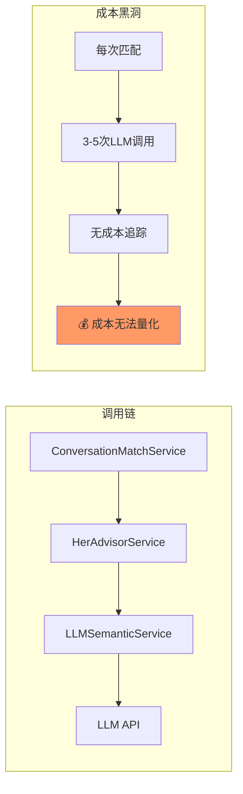

**问题位置**: `llm_semantic_service.py`

**修复状态**: ✅ 已新增 `LLMMetricsDB` 和 `llm_cost_tracker.py`

---

### 4.6 查询质量校验追问陷阱

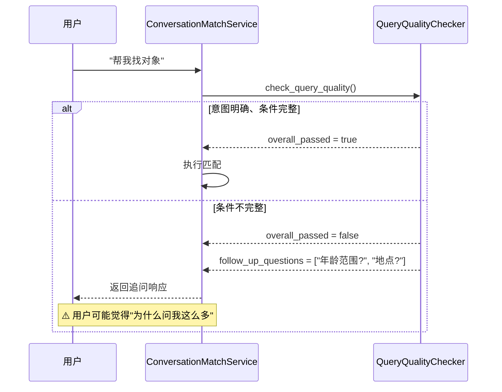

**设计权衡**：
- 优点：确保匹配精准度
- 缺点：增加交互轮次，用户可能流失

**建议**：设置 `skip_quality_check` 快捷操作，允许用户跳过追问直接匹配。

---

### 4.7 匿名用户特殊处理陷阱

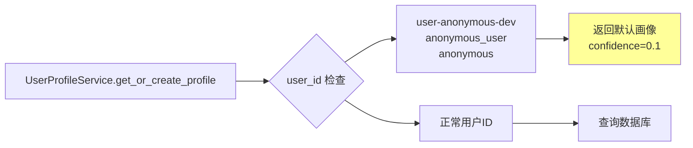

**位置**: [user_profile_service.py:118-128](src/services/user_profile_service.py#L118-L128)

**影响**：匿名用户（开发测试场景）画像置信度极低，匹配质量会受影响。

---

## 五、重构建议 (Refactoring Roadmap)

### 5.1 痛点一：ConversationMatchService 职责过重

**现状**：
- 单文件 1100+ 行
- 承担：意图分析 + 查询校验 + 匹配执行 + 认知偏差 + 建议生成 + UI构建

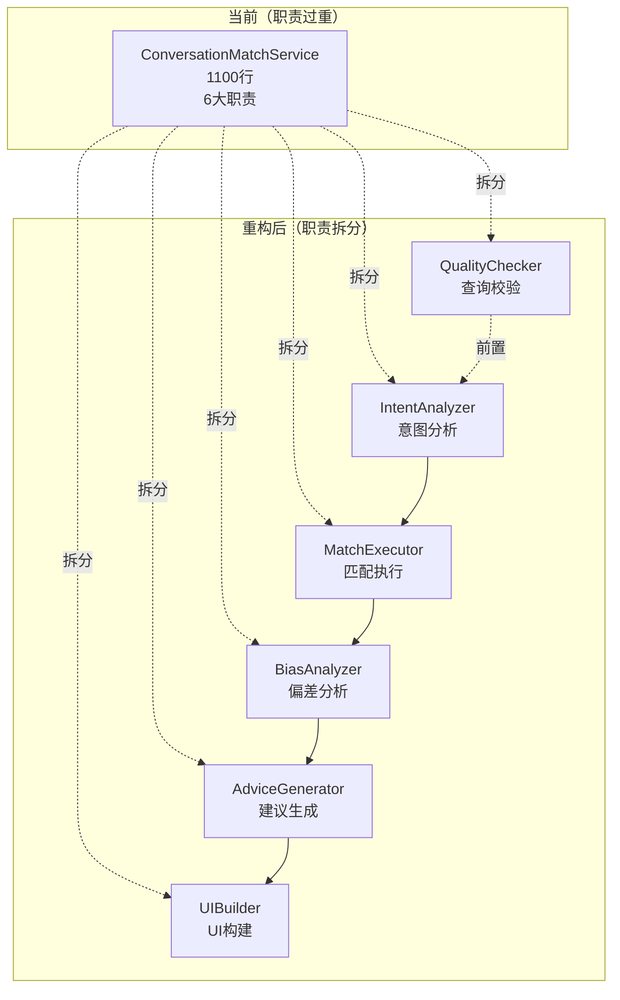

**重构方案**：
```python
# src/services/conversation_match_service.py（重构后）
class ConversationMatchService:
    """对话匹配服务 - 仅做编排"""
    
    def __init__(self):
        self._intent_analyzer = IntentAnalyzer()
        self._match_executor = MatchExecutor()
        self._bias_analyzer = BiasAnalyzer()
        self._advice_generator = AdviceGenerator()
        self._ui_builder = UIBuilder()
        self._quality_checker = QualityChecker()
    
    async def process_message(self, user_id, message) -> Response:
        # 1. 查询质量校验
        quality = await self._quality_checker.check(message)
        if not quality.passed:
            return self._build_followup_response(quality)
        
        # 2. 意图分析
        intent = await self._intent_analyzer.analyze(message)
        
        # 3. 匹配执行
        matches = await self._match_executor.execute(user_id, intent)
        
        # 4. 偏差分析
        bias = await self._bias_analyzer.analyze(user_id)
        
        # 5. 建议生成
        advice = await self._advice_generator.generate(matches, bias)
        
        # 6. UI构建
        ui = self._ui_builder.build(advice)
        
        return Response(ui=ui, advice=advice)
```

---

### 5.2 痛点二：意图路由规则配置化

**现状**：
- IntentRouterSkill 包含 15 种意图 + 关键词映射 + 优先级列表
- 新增意图需修改代码

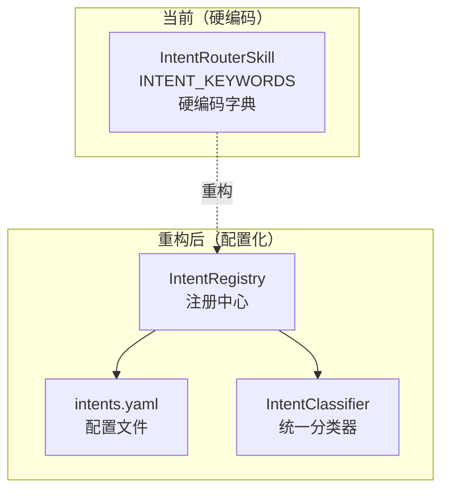

**配置文件设计**：
```yaml
# src/config/intents.yaml
intents:
  - name: matching
    keywords: ["找人", "匹配", "介绍对象", "推荐"]
    priority: 10  # 低优先级
    skill: conversation_matchmaker
    description: "找对象匹配"
    
  - name: daily_recommend
    keywords: ["今日推荐", "每日推荐"]
    priority: 9  # 高优先级（避免"推荐"歧义）
    skill: conversation_matchmaker
    description: "每日推荐"
    
  - name: profile_collection
    keywords: ["完善资料", "填信息"]
    priority: 8
    skill: profile_collection
    condition: "profile_completeness < 0.8"
```

---

### 5.3 痛点三：LLM 调用成本可视化

**现状**：
- 每次匹配 3-5 次 LLM 调用
- 无成本监控仪表板

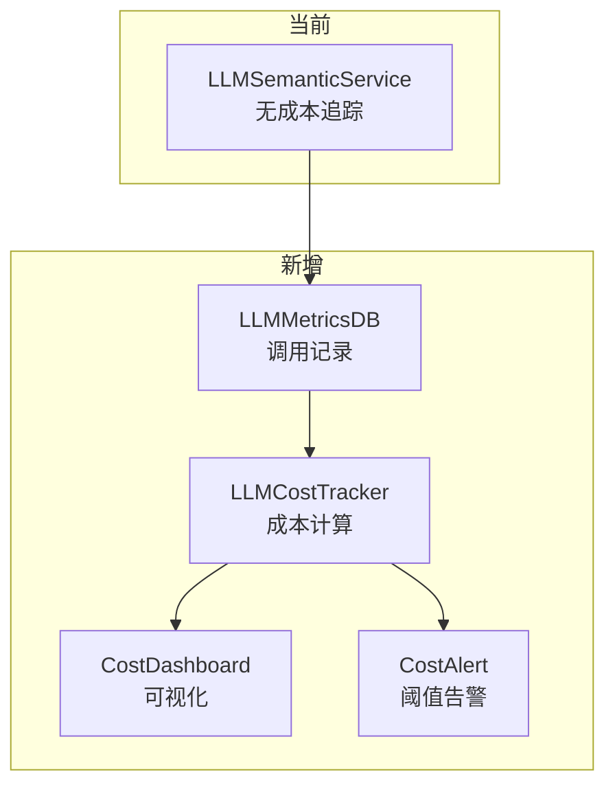

**成本追踪器设计**：
```python
# src/utils/llm_cost_tracker.py
class LLMCostTracker:
    """LLM 成本追踪器"""
    
    COST_PER_1K_TOKENS = {
        "gpt-4": {"input": 0.03, "output": 0.06},
        "gpt-3.5-turbo": {"input": 0.001, "output": 0.002},
        "qwen": {"input": 0.002, "output": 0.006},
    }
    
    def calculate_cost(self, model, input_tokens, output_tokens) -> float:
        rates = self.COST_PER_1K_TOKENS.get(model, {})
        input_cost = (input_tokens / 1000) * rates.get("input", 0)
        output_cost = (output_tokens / 1000) * rates.get("output", 0)
        return input_cost + output_cost
    
    def get_daily_cost(self, date) -> float:
        """获取当日总成本"""
        pass
    
    def check_budget(self, threshold) -> bool:
        """检查是否超出预算"""
        pass
```

---

### 5.4 痛点四：前端骨架屏组件统一

**现状**：
- ChatInterface.tsx 内联 3 个骨架屏组件
- 约 50 行冗余代码

```typescript
// 当前（内联）
const InlineFeatureCardSkeleton = () => <Card><Skeleton active /></Card>
const InlineMatchCardSkeleton = () => <Card><Skeleton.Image /><Skeleton active /></Card>
const InlineQuestionCardSkeleton = () => <Card><Skeleton.Input active /></Card>
```

**重构方案**：
```typescript
// frontend/src/components/skeletons.tsx
export const SkeletonComponents = {
  featureCard: () => <Card><Skeleton active /></Card>,
  matchCard: () => <Card><Skeleton.Image /><Skeleton active /></Card>,
  questionCard: () => <Card><Skeleton.Input active /></Card>,
  list: (count: number) => <>{Array(count).fill(null).map(() => <Skeleton active />)}</>,
};

// ChatInterface.tsx 使用
import { SkeletonComponents } from './skeletons';
<Suspense fallback={<SkeletonComponents.matchCard />}>
```

**修复状态**: ✅ 已实现 [skeletons.tsx](frontend/src/components/skeletons.tsx)

---

### 5.5 痛点五：API 路由注册中心优化

**现状**：
- routers/__init__.py 手动导入 43 个路由
- 新增路由需手动添加

```python
# 当前
from api.users import router as users_router
from api.matching import router as matching_router
# ... 43 个手动导入
app.include_router(users_router)
app.include_router(matching_router)
# ... 43 个手动注册
```

**优化方案**：
```python
# src/routers/__init__.py（优化后）
import importlib
import os

def register_all_routers(app: FastAPI) -> None:
    """自动扫描注册所有路由"""
    api_dir = os.path.dirname(__file__)
    
    for file in os.listdir(api_dir):
        if file.endswith(".py") and file != "__init__.py":
            module_name = file[:-3]
            module = importlib.import_module(f"api.{module_name}")
            
            if hasattr(module, "router"):
                app.include_router(module.router)
                logger.info(f"Registered router: {module_name}")
```

---

### 5.6 痛点六：数据库模型拆分

**现状**：
- models.py 1592 行
- 包含 42 个模型定义

**重构方案**：
```
src/db/models/
├── __init__.py        # 导出所有模型
├── user.py            # UserDB, UserPreferenceDB, UserVectorProfileDB
├── matching.py        # MatchHistoryDB, SwipeActionDB, MatchInteractionDB
├── conversation.py    # ConversationDB, ChatMessageDB, ChatConversationDB
├── relationship.py    # RelationshipProgressDB, AIPreCommunicationSessionDB
├── membership.py      # UserMembershipDB, MembershipOrderDB
├── safety.py          # UserBlockDB, UserReportDB, SafetyZoneDB
├── verification.py    # PhotoDB, IdentityVerificationDB, VerificationBadgeDB
├── autonomous.py      # AgentTaskDB, PushHistoryDB, TriggerEventDB
└── metrics.py         # LLMMetricsDB, SemanticAnalysisDB
```

---

## 六、架构健康度评估

| 维度 | 评分 | 说明 | 改进建议 |
|------|------|------|----------|
| **分层清晰度** | 🟡 7/10 | API→Service→Skill→Data 基本清晰 | 拆分 ConversationMatchService |
| **模块内聚性** | 🟡 6/10 | Service 层职责偏重 | 职责拆分重构 |
| **依赖健康度** | 🟢 8/10 | 无严重循环依赖 | 保持现状 |
| **可扩展性** | 🟢 8/10 | Skill 注册表 + GenerativeUI 易扩展 | 配置化意图路由 |
| **可观测性** | 🟡 5/10 | LLM 成本已追踪，缺调用链 | 增加分布式追踪 |
| **文档完整性** | 🟢 7/10 | 关键逻辑有文档，隐性逻辑已记录 | 补充 API 文档 |
| **性能优化** | 🟢 7/10 | LRU缓存+LLM缓存+并行调用 | 增加批量查询优化 |
| **测试覆盖率** | 🔴 4/10 | 单元测试不足 | 补充关键链路测试 |

---

## 七、总结与优先级建议

### 立即处理（P0）

| 问题 | 影响 | 修复方案 |
|------|------|----------|
| 意图关键词歧义 | 用户说"推荐"识别错误 | ✅ 已修复：移除 DAILY_RECOMMEND 的"推荐" |
| 前后端画像判断不一致 | 新用户流程混乱 | ✅ 已修复：两端均查询数据库 |
| GenerativeUI映射分散 | 新增组件易遗漏 | ✅ 已修复：统一到 generative_ui_schema.py |

### 近期优化（P1）

| 问题 | 影响 | 修复方案 |
|------|------|----------|
| ConversationMatchService 职责过重 | 维护困难 | 拆分为 6 个独立组件 |
| LLM成本可视化缺失 | 成本无法量化 | ✅ 已实现 LLMMetricsDB + CostTracker |
| 骨架屏组件冗余 | 代码冗余 | ✅ 已实现 skeletons.tsx |

### 中期规划（P2）

| 问题 | 影响 | 修复方案 |
|------|------|----------|
| 意图路由硬编码 | 扩展困难 | 配置化：intents.yaml |
| models.py 过大 | 维护困难 | 拆分为多个文件 |
| API路由手动注册 | 新增易遗漏 | 自动扫描注册 |

### 长期演进（P3）

| 问题 | 影响 | 修复方案 |
|------|------|----------|
| DeerFlow Memory 双向同步 | 学习结果未回传 | ✅ 已实现 learning_result_handler |
| 测试覆盖率不足 | 回归风险 | 补充单元测试 |
| 分布式追踪缺失 | 调用链不透明 | 集成 OpenTelemetry |

---

## 八、附录：关键文件清单

### 核心文件（必读）

| 文件 | 行数 | 职责 | 链接 |
|------|------|------|------|
| `src/db/models.py` | 1592 | 数据模型定义 | [models.py](src/db/models.py) |
| `src/api/deerflow.py` | 800 | DeerFlow 统一入口 | [deerflow.py](src/api/deerflow.py) |
| `src/services/conversation_match_service.py` | 1100 | 对话匹配核心 | [conversation_match_service.py](src/services/conversation_match_service.py) |
| `src/services/her_advisor_service.py` | 1000 | Her 顾问核心 | [her_advisor_service.py](src/services/her_advisor_service.py) |
| `src/services/llm_semantic_service.py` | 1200 | LLM 语义服务 | [llm_semantic_service.py](src/services/llm_semantic_service.py) |
| `src/services/user_profile_service.py` | 920 | 用户画像服务 | [user_profile_service.py](src/services/user_profile_service.py) |
| `src/agent/skills/intent_router_skill.py` | 615 | 意图路由 | [intent_router_skill.py](src/agent/skills/intent_router_skill.py) |
| `src/generative_ui_schema.py` | 214 | GenerativeUI Schema | [generative_ui_schema.py](src/generative_ui_schema.py) |
| `frontend/src/components/ChatInterface.tsx` | 800+ | 前端对话入口 | [ChatInterface.tsx](frontend/src/components/ChatInterface.tsx) |
| `src/main.py` | 299 | 应用入口 | [main.py](src/main.py) |

### 设计文档

| 文件 | 说明 | 链接 |
|------|------|------|
| `AUTONOMOUS_AGENT_ENGINE_DESIGN.md` | 自主代理引擎设计 | [AUTONOMOUS_AGENT_ENGINE_DESIGN.md](docs/AUTONOMOUS_AGENT_ENGINE_DESIGN.md) |
| `DUAL_ENGINE_MATCH_ARCHITECTURE.md` | 双引擎匹配架构 | [DUAL_ENGINE_MATCH_ARCHITECTURE.md](docs/DUAL_ENGINE_MATCH_ARCHITECTURE.md) |
| `HER_ADVISOR_ARCHITECTURE.md` | Her 顾问架构 | [HER_ADVISOR_ARCHITECTURE.md](src/HER_ADVISOR_ARCHITECTURE.md) |
| `VECTOR_MATCH_SYSTEM_DESIGN.md` | 向量匹配系统设计 | [VECTOR_MATCH_SYSTEM_DESIGN.md](docs/VECTOR_MATCH_SYSTEM_DESIGN.md) |

---

> 本报告基于 2026-04-13 全量代码扫描生成，建议结合实际运行日志验证关键链路性能。
> 
> **报告版本**: v2.0
> **生成工具**: Claude 深度架构分析
> **覆盖范围**: 43 API + 96 Services + 40 Skills + 42 Models