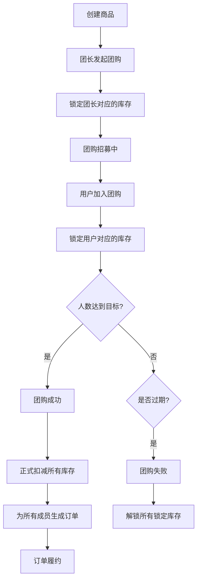

# AI 社区团购 (AI Community Buying)

## 项目概述
面向社区场景的 **AI 驱动供需匹配** 平台：在选品、成团概率与定价上辅助团长决策，降低运营摩擦，并支撑小规模电商闭环（商品—团购—履约）。

## 核心功能

### ✅ 已实现（P0 阶段）
- **商品管理**: 商品创建、查询、库存管理、状态管理
- **团购系统**:
  - 发起团购（库存预锁定、参数校验）
  - 加入团购（重复加入校验、满员校验、过期校验）
  - 自动成团（达到人数后自动变更状态、扣减库存）
  - 过期/失败自动处理（库存解锁）
  - 团购取消（仅团长可操作）
- **订单系统**: 成团后自动生成订单、订单状态流转
- **参团记录**: 完整的参团历史和用户行为追踪
- **库存管理**: 三级库存体系（可用/锁定/已售），支持自动状态流转

### 🔄 开发中（P1 阶段）
- **智能选品**: AI 分析需求推荐商品
- **动态定价**: 基于成团概率的动态价格优化
- **库存预警**: 低库存自动提醒
- **通知系统**: 拼团进度、成团结果通知

### 📅 规划中（P2 阶段）
- **需求预测**: 基于历史数据预测销量优化库存
- **地域运营**: 按社区/社群维度的运营能力
- **供应链管理**: 智能采购和物流调度
- **用户认证**: 与统一认证系统集成

## 技术栈
- 后端：Python + FastAPI
- 数据模型：Pydantic
- 数据库：PostgreSQL + Redis
- AI: LLM + 推荐系统 + 时序预测
- 前端：小程序 + React (规划中)

## 项目结构
```
ai-community-buying/
├── src/
│   ├── api/              # API 路由层
│   │   └── products.py   # 商品/团购/订单接口
│   ├── models/           # 数据模型层
│   │   └── product.py    # 商品/团购/订单/参团记录模型
│   ├── services/         # 业务逻辑层
│   │   └── groupbuy_service.py  # 核心业务逻辑
│   └── main.py           # 服务入口
├── demo.py               # 业务流程演示脚本
├── requirements.txt      # 依赖清单
├── .env.example          # 环境变量示例
├── PLANNING.md           # 项目规划
└── README.md             # 项目说明
```

## 快速开始

### 1. 环境准备
```bash
# 安装依赖
pip install -r requirements.txt

# 复制环境变量配置
cp .env.example .env
# 按需修改 .env 中的配置
```

### 2. 运行演示（验证业务流程）
```bash
# 运行完整业务流程演示
python demo.py
```

### 3. 启动API服务
```bash
# 启动服务
python src/main.py
```

服务启动后访问：
- API 文档: http://localhost:8005/docs
- 健康检查: http://localhost:8005/health

## API 接口说明

### 商品管理
- `GET /api/products` - 获取商品列表
- `POST /api/products` - 创建商品
- `GET /api/products/{product_id}` - 获取商品详情

### 团购管理
- `GET /api/groups` - 获取活跃团购列表
- `POST /api/groups` - 发起团购
- `GET /api/groups/{group_id}` - 获取团购详情
- `POST /api/groups/{group_id}/join` - 加入团购
- `DELETE /api/groups/{group_id}` - 取消团购

### 订单管理
- `GET /api/orders/{order_id}` - 获取订单详情
- `GET /api/users/{user_id}/orders` - 获取用户订单列表
- `PATCH /api/orders/{order_id}/status` - 更新订单状态

### 统计查询
- `GET /api/users/{user_id}/join-records` - 获取用户参团记录
- `GET /api/groups/{group_id}/join-records` - 获取团购参团记录

## 核心业务规则

### 库存管理规则
1. **预锁定机制**: 用户参团时先锁定库存，避免超卖
2. **成团扣减**: 团购成功后正式扣减库存
3. **失败回滚**: 团购失败/过期/取消时，自动解锁所有锁定库存
4. **状态自动流转**: 库存为0时商品自动标记为售罄，库存补货后自动恢复上架

### 团购状态流转
```
OPEN (招募中) → SUCCESS (成团成功) → 生成订单
              → EXPIRED (已过期) → 解锁库存
              → FAILED (成团失败) → 解锁库存
              → CANCELLED (已取消) → 解锁库存
```

### 订单状态流转
```
PENDING (待支付) → PAID (已支付) → DELIVERING (配送中) → COMPLETED (已完成)
                → CANCELLED (已取消) → REFUNDED (已退款)
```

## 业务流程示例



## 状态
🚀 **P0 阶段已完成**: 商品/库存/团购单/参团最小业务闭环已实现，可本地端到端演示。
